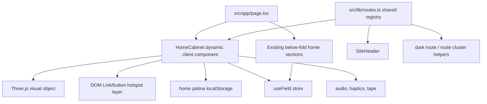

# Wondrous Homepage Entry Object

## Goal Capsule

- Objective: rebuild the first impression of `/` so it feels as beautiful, tactile, and self-explanatory as `/coin`, `/movement`, and `/beyond`, while preserving the existing field, atlas, reading, archive, and colophon journey below it.
- Authority hierarchy: the user wants `/coin` treated as the canonical quality bar, with `/movement` and `/beyond` as supporting examples; the repo thesis says meaning should emerge through use, not explanation; existing route/navigation behavior must keep working.
- Execution profile: frontend-only Next.js/React/Three.js work in a fresh branch from `origin/main`; no backend, auth, data migration, or new service dependency.
- Stop conditions: the homepage has its own wondrous interactive identity, route navigation is discoverable through a real playable object, first-time users can understand the site by touching/focusing it, existing anchors and deeper flows still work, and lint/type/build plus browser visual checks pass.
- Tail ownership: the implementation pass should merge the finished PR after review, in keeping with the repo rule for this project.

---

## Product Contract

### Summary

Replace the current text-first threshold with a first-screen interactive artifact: the **Cabinet of Currents**.
It should feel like a single crafted object sitting between sea, candlelight, atlas, and mechanism: a gold-and-glass orrery/cabinet whose facets are real route doors.
Dragging, tilting, hovering, focusing, or tapping the object should light different currents, play restrained audio/haptic feedback, leave tape pulses, and reveal where the user can go.

The current home already contains many strong instruments, but its first screen is now weaker than the newer immersive routes.
The new home should become an instrument first and an index second: route labels, current state, kept readings, and the "tune, cross, read, keep" flow should emerge from the object instead of a marketing paragraph.

### Problem Frame

The current homepage is a stitched scroll journey: `Threshold`, `SeaChart`, `ConcernField`, `Atlas`, `Reading`, `Sea`, `Archive`, and `Colophon`.
That journey is valuable, but the first impression is mostly copy plus buttons, so it does not match the material confidence of `/coin` or the immediate playfulness of `/movement` and `/beyond`.
It also does not communicate the site's practical shape quickly enough: new users may feel the atmosphere before they know whether to tune concerns, open the atlas, keep a reading, or explore the other route constellation.

The stronger recent pages share a grammar:

- A single believable surface owns the first viewport.
- High-frequency interaction stays imperative/ref-driven instead of React-state-driven.
- Every gesture has visual, audio, haptic, tape, and sometimes persistent consequences.
- Controls are compact and progressive.
- Mobile/touch is a first-class input mode.
- The object has rules the user can learn.

The homepage should borrow that grammar without cloning any specific route.

### Requirements

**First-Screen Identity**

- R1. `/` opens on a unique full-viewport playable artifact, not a conventional hero section and not a collage of cards.
- R2. The artifact must have a material identity distinct from `/coin`, `/movement`, and `/beyond`: a cabinet/orrery/lens object that blends devotional candle, operational instrument, and oceanic current.
- R3. The first viewport must show a hint of the next home content below on common mobile and desktop viewport heights, so the deeper field journey remains legible as a continuation.
- R4. The object must respond immediately to pointer/touch/focus with visible motion and light, even before the user understands every route.

**Orientation And Use**

- R5. The home must communicate the site's practical flow through interaction: tune the field, cross the atlas, receive/keep a reading, and explore route instruments.
- R6. Avoid long explanatory onboarding copy; use object labels, route names, one-line route functions, state readouts, and affordance choreography instead.
- R7. The current `ConcernField`, `Atlas`, `Reading`, `Archive`, and `Colophon` sections remain reachable by scroll and by route-object interactions.
- R8. Existing home anchor IDs stay stable where practical: `live-chart`, `concern-field`, `atlas`, `reading`, `archive`, and `colophon`.

**Route Navigation**

- R9. The artifact exposes the public route constellation from `SiteHeader`: `atlas`, `ocean`, `tide`, `waves`, `sine`, `pretext`, `circularity`, `beyond`, `storm`, `clouds`, `aphros`, `flowers`, `fire`, `earth`, `growth`, `stars`, `signal`, `light`, `plasma`, `pulse`, `charts`, `time`, `movement`, `jewel`, `coin`, `watch`, `archive`, `kept`, and `colophon`.
- R10. Primary destinations should be visibly privileged: `atlas`, `tide` or water/waves, `watch`/object routes, `coin`, `movement`, `beyond`, and the local field/reading flow.
- R11. Route navigation must use real `Link`/button DOM affordances with keyboard focus and usable names; canvas/WebGL hit testing may enhance but must not be the only navigation path.
- R12. Utility/deep-link routes such as `/reading/[hash]` and `/compare?a=&b=` should appear only when the user's local state makes them meaningful, such as kept readings or a selected comparison.

**State, Memory, And Feedback**

- R13. The home object uses the existing `useField` store, `getFieldAudio()`, `recordTape`, haptics module, and persisted kept readings rather than inventing a separate product state model.
- R14. Interactions leave a small persistent patina, similar in spirit to `/coin`'s accumulated brilliance, so return visits feel subtly changed without overwhelming the object.
- R15. The object reflects existing user state where useful: current concern sigil in the center, kept readings as stars/facets, and route/cluster emphasis from recent interaction.
- R16. Reduced-motion users get a composed static or low-motion version with the same navigation and state information.

**Mobile, Accessibility, And Performance**

- R17. Touch behavior must allow both object play and normal vertical page navigation; avoid trapping the entire viewport behind `touch-action: none`.
- R18. Tap/focus targets must be at least 44px in practical hit area, including route facets and mobile controls.
- R19. The new first viewport should not make the existing heavy home worse by mounting every RAF/WebGL/canvas system eagerly if it can be avoided.
- R20. The implementation must keep fixed chrome usable: sticky header, tape, field watch, candle, and sound toggle should not overlap core route hotspots on desktop or mobile.

### Key Flows

- F1. First visit discovery
  - Trigger: a new visitor lands on `/`.
  - Steps: the Cabinet of Currents is already alive; pointer/touch/focus lights a facet; the selected route/function appears as a small local label; activating the facet navigates or scrolls.
  - Outcome: the user understands the site is something to use, not just read.
  - Covers: R1, R4, R5, R6, R11.

- F2. Local instrument path
  - Trigger: the user chooses the field/center/reading current instead of leaving to another route.
  - Steps: the object scrolls to `concern-field`, `atlas`, or `reading`; existing components continue using current `useField` state.
  - Outcome: the new home object becomes the doorway to the original instrument, not a replacement for it.
  - Covers: R5, R7, R8, R13.

- F3. Route constellation path
  - Trigger: the user chooses a route facet such as `coin`, `movement`, `beyond`, `waves`, or `stars`.
  - Steps: the facet highlights, feedback fires, a tape event records the route choice, and the user navigates via a real Next `Link`.
  - Outcome: route discovery feels like handling an object, while preserving normal web navigation.
  - Covers: R9, R10, R11, R13.

- F4. Return visit patina
  - Trigger: a returning visitor reopens `/`.
  - Steps: local home patina and kept readings load; the cabinet glows or reveals accumulated facets without blocking use.
  - Outcome: the homepage feels personally handled over time.
  - Covers: R14, R15.

### Scope Boundaries

- This plan does not redesign every route.
- This plan does not add auth, server persistence, or cross-device sync.
- This plan does not remove the existing field/atlas/reading/archive flow.
- This plan does not require text-heavy onboarding. Some labels and one-line route functions are allowed because they are navigation affordances, not marketing copy.
- This plan does not require generating bitmap art. The object should be rendered in code with Three.js/canvas/SVG, using the established site palette and route sigils.

---

## Planning Contract

### Key Technical Decisions

- KTD1. Build a home-only **Cabinet of Currents** component as the first-screen instrument. Use Three.js directly, following `/coin` and `/movement`, with an imperative RAF loop and mutable refs for high-frequency gesture/light state.
- KTD2. Keep navigation accessible by layering real DOM `Link`/button hotspots over or beside the visual object. The Three.js scene is the sensory surface; DOM controls are the contractual navigation surface.
- KTD3. Extract the route constellation from `SiteHeader.tsx` into a shared route registry before building the cabinet. The header, home object, metadata-adjacent code, and tests should not keep divergent route lists.
- KTD4. Treat the current home sections as the deeper instrument. Replace `Threshold` as the first impression, but preserve `SeaChart`, `ConcernField`, `Atlas`, `Reading`, `Sea`, `Archive`, and `Colophon` below, with possible lazy mounting for heavy below-fold systems.
- KTD5. Add home patina as local-only client state, not Zustand global state unless another component must read it. It should persist as `objetdart:home-cabinet:v1` and contain only non-sensitive visual progress such as route touches, glow, last cluster, and visit count.
- KTD6. Reconcile dark-route knowledge while extracting routes. `SiteHeader` currently has a fuller inline dark list than `src/lib/dark-routes.ts`; the implementation should centralize or intentionally bridge this before route palette previews depend on it.

### High-Level Technical Design

The Cabinet of Currents should compose four route clusters around a central user-state lens:

- Field: local anchors and core instrument destinations, including `concern-field`, `atlas`, `reading`, `archive`, `kept`, `colophon`.
- Water/Text: `ocean`, `tide`, `waves`, `sine`, `pretext`, `circularity`, `beyond`, `storm`, `clouds`, `aphros`.
- Element/Cosmos: `flowers`, `fire`, `earth`, `growth`, `stars`.
- Mechanism/Signal/Object: `signal`, `light`, `plasma`, `pulse`, `charts`, `time`, `movement`, `jewel`, `coin`, `watch`.

The visual object can render these as nested rings, hinged drawers, or gemstone facets.
Implementation should privilege material specificity: gold rim, sea-glass lens, candle-glow core, route gems, and subtle diamond dust/patina.
The center should render the current `ConcernSigil` shape or a compatible canvas/SVG projection so the user sees that the site is reading their current field state.

### Research Sources

- `src/app/page.tsx`: current homepage composition and anchor seams.
- `src/components/Threshold.tsx`: current first-screen copy/actions, kept constellation, sea handoff.
- `src/components/Coin.tsx`: canonical immersive object, persistent brilliance, ref-driven gestures, motion/audio/haptic/tape integration.
- `src/components/Movement.tsx`: credible mechanical object, compact HUD, camera/view controls, object part tapping.
- `src/components/BeyondWaveField.tsx`: touch-as-system-input, progressive controls, keep/replay memory.
- `src/components/SiteHeader.tsx`: current public route inventory and header anchor behavior.
- `src/components/RouteSigil.tsx`: existing single-stroke route visual vocabulary.
- `src/store/field.ts`: persisted field state, kept readings, session tape.
- `README.md` and `DESIGN.md`: product thesis that meaning emerges through use and water is the template for all modalities.

### Assumptions

- The implementation can add a new large client component without introducing React Three Fiber or another rendering dependency.
- The home route can remain client-rendered, as it already is.
- The user prefers a materially ambitious first pass over a minimal redesign.
- Exact object naming and microcopy can be tuned during polish as long as the product requirements remain intact.

---

## Implementation Units

### U1. Shared Route Registry And Chrome Alignment

- **Goal:** Create one source of truth for public routes, route clusters, route sigils, home anchor behavior, primary destinations, and dark-route flags.
- **Requirements:** R8, R9, R10, R11, R20.
- **Files:** `src/lib/routes.ts`, `src/components/SiteHeader.tsx`, `src/lib/dark-routes.ts`, possibly `src/lib/site-icon-config.ts`.
- **Approach:** Move the `ROUTES` and `PRIMARY` data from `SiteHeader.tsx` into `src/lib/routes.ts`. Add fields for `cluster`, `homePriority`, `homeAnchor`, and `dark`. Update `SiteHeader` to consume the shared registry and preserve current behavior exactly. Update `isDarkRoute` or add a helper that covers `/coin`, `/movement`, and `/jewel` consistently.
- **Test Scenarios:** Header still renders primary nav and all panel routes; home anchors still scroll on `/`; non-home anchors still navigate; TypeScript catches route key/icon mismatches.
- **Verification:** `npx tsc --noEmit`, focused browser smoke of header panel and home anchor links.

### U2. Cabinet Of Currents Visual Instrument

- **Goal:** Build the first-viewport object that makes the homepage feel like a new canonical route-level experience.
- **Requirements:** R1, R2, R3, R4, R14, R15, R16, R17, R19.
- **Files:** `src/components/HomeCabinet.tsx`, `src/app/page.tsx`, optionally `src/lib/home-cabinet-state.ts`.
- **Approach:** Add a client component with a Three.js scene: gold-and-glass object, central state lens, route/cluster facets, particle glints, and animated light responding to pointer/touch/focus. Use `ResizeObserver`, capped DPR, reduced-motion checks, `requestAnimationFrame`, and cleanup patterns from `Coin` and `Movement`. Keep high-frequency values in refs. Expose a small `window.__homeCabinet = { ready, selectRoute, setCluster }` hook for screenshot verification.
- **Test Scenarios:** First paint is nonblank; resizing preserves object framing; reduced motion still shows a composed static object; no hydration crash on server render; unmount cleans renderer/listeners.
- **Verification:** `npm run build`, Playwright screenshot and canvas-pixel check at desktop and mobile widths.

### U3. Accessible Route Hotspots And Local Orientation

- **Goal:** Make every route/facet usable by click, tap, keyboard, and assistive technology while keeping the object magical.
- **Requirements:** R5, R6, R9, R10, R11, R12, R18, R20.
- **Files:** `src/components/HomeCabinet.tsx`, `src/lib/routes.ts`, possibly `src/components/RouteSigil.tsx`.
- **Approach:** Render a DOM overlay of `Link` elements for route facets and buttons for local anchors. Use route registry positions/cluster membership. Hover/focus selects the visual facet; activation records route feedback and navigates. Keep labels short: route name plus one-line function from the existing `desc`. For mobile, use cluster tabs/ring rotation so targets stay large instead of packing 29 tiny links into one view.
- **Test Scenarios:** Tab order reaches major route clusters and individual facets; Enter activates links; all actionable targets are at least 44px in hit area; `/atlas/origin` is used where there is no `/atlas` index; `/reading/[hash]` and compare links appear only when meaningful.
- **Verification:** Manual keyboard pass, mobile viewport pass, `npm run lint`.

### U4. Preserve And Reframe The Existing Home Journey

- **Goal:** Keep the existing instrument depth while removing the old threshold as the dominant first impression.
- **Requirements:** R3, R5, R7, R8, R19.
- **Files:** `src/app/page.tsx`, `src/components/Threshold.tsx` or a new smaller `src/components/HomeFieldPrelude.tsx`, optionally dynamic imports for below-fold modules.
- **Approach:** Replace the top `Threshold` render with `HomeCabinet`. Keep `SeaChart`, `ConcernField`, `Atlas`, `Reading`, returning `Sea`, `Archive`, and `Colophon` below. Decide whether `Threshold` is deleted, demoted to a compact below-object prelude, or left unused. Preserve scroll margins. Consider lazy mounting the heaviest below-fold modules after the first viewport or via dynamic imports to reduce simultaneous RAF/canvas load.
- **Test Scenarios:** Scrolling from the home object reaches the same instruments; route-object local anchors land correctly; kept constellation or equivalent kept-reading signal remains discoverable; no below-fold section loses state.
- **Verification:** Browser smoke of local anchor flow: field, chart, atlas, reading, archive, colophon.

### U5. Patina, Audio, Haptics, And Tape Integration

- **Goal:** Give the new home object the same consequence layer that makes `/coin`, `/movement`, and `/beyond` feel alive.
- **Requirements:** R4, R13, R14, R15, R16.
- **Files:** `src/components/HomeCabinet.tsx`, optionally `src/lib/home-cabinet-state.ts`.
- **Approach:** On pointer/focus/route interaction, call `getFieldAudio()` for restrained notes/chimes, haptics for taps/ripples, and `useField.getState().recordTape(...)` with route/cluster metadata. Persist local patina with guarded `localStorage` reads/writes. The patina should slowly saturate visual richness but avoid whiteout or clutter. Reflect kept readings as optional small stars or route-side glints when `keptReadings.length > 0`.
- **Test Scenarios:** Interactions produce tape pulses; muted audio state is respected by existing audio module; localStorage errors fail silently; patina survives reload; reduced-motion users still get state without heavy animation.
- **Verification:** Manual localStorage reload smoke, tape visual smoke, reduced-motion emulation.

### U6. Browser Polish And Verification Harness

- **Goal:** Prove the new homepage works as an interactive visual surface, not just as compiling code.
- **Requirements:** R1 through R20.
- **Files:** Existing or new scripts under `scripts/` if helpful, such as `scripts/shot-home.mjs`.
- **Approach:** Add or adapt a Playwright script similar to existing screenshot scripts if it speeds verification. Capture `/` at desktop and mobile, check that the canvas has non-background pixels, exercise one route selection, and verify local anchor scrolling. Keep the script small and repo-native.
- **Test Scenarios:** Desktop first viewport; mobile first viewport; keyboard focus; route click to `/coin` or `/beyond`; local anchor scroll to `concern-field`; reduced-motion snapshot.
- **Verification:** Commands in the Verification Contract plus saved screenshots if useful for review.

---

## Verification Contract

| Check | Command / Method | Applies To | Done Signal |
|---|---|---|---|
| Lint | `npm run lint` | All units | No ESLint errors |
| Type check | `npx tsc --noEmit` | All units | No TypeScript errors |
| Production build | `npm run build` | All units | Next build completes |
| Desktop visual QA | Playwright or browser screenshot of `/` around 1440x1000 | U2, U3, U4, U5 | Cabinet is nonblank, framed, interactive, and not overlapped by chrome |
| Mobile visual QA | Playwright or browser screenshot of `/` around 390x844 | U2, U3, U4, U5 | Cabinet fits, route targets are usable, vertical scroll remains possible |
| Canvas/object pixel check | Scripted screenshot or canvas sampling | U2, U6 | Primary visual surface is not blank/flat background |
| Navigation smoke | Activate a route facet and a local anchor | U1, U3, U4 | Route facet navigates, local anchor scrolls correctly |
| Accessibility smoke | Keyboard tab through first viewport | U3 | Focus is visible, labels are understandable, Enter/Space activate expected controls |
| Reduced motion smoke | Browser emulation of `prefers-reduced-motion: reduce` | U2, U5 | Static/low-motion object remains usable |

---

## Definition of Done

- The first viewport of `/` is a new, beautiful, interactive Cabinet of Currents rather than the old text/button threshold.
- Users can discover and activate route destinations from the home object with pointer, touch, and keyboard.
- The home object communicates the core site flow through state and affordances: tune, cross, read, keep, and explore.
- The existing below-fold home journey remains intact and reachable.
- Route data is shared rather than duplicated between the header and home object.
- Patina, audio, haptics, and tape integration are present but restrained.
- Desktop and mobile screenshots have been inspected for framing, overlap, text fit, and visual richness.
- `npm run lint`, `npx tsc --noEmit`, and `npm run build` pass before commit.
- Any experimental or dead-end code from the implementation pass is removed before merge.
