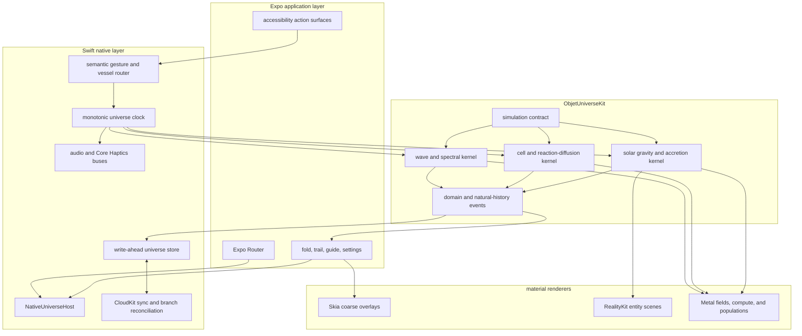
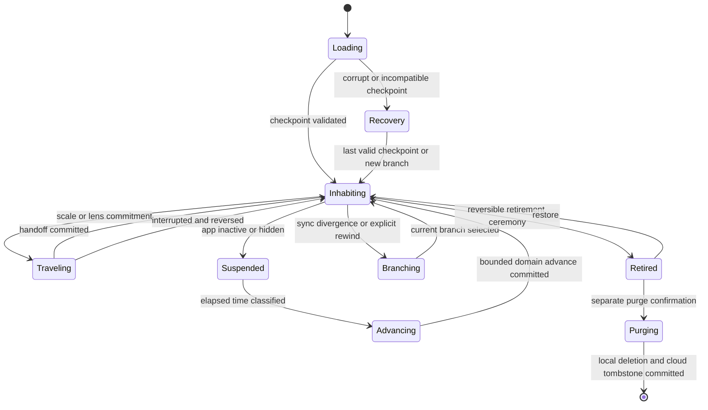
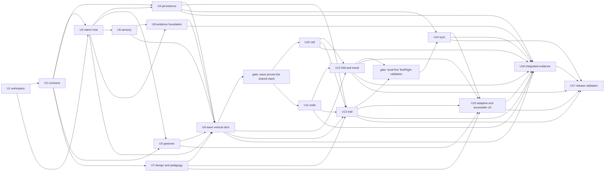

# Rebirth objet d'art as a native cosmogony garden

## Goal Capsule

- **Objective:** build an iPhone and iPad native first release that proves objet d'art can become a persistent cosmogony garden: one universe played through the device, understood through lawful consequences, and revisited through its natural history.
- **First-release proof:** ship a wave and spectral instrument, a persistent cellular colony, and a forming solar system on one shared native foundation, with fold navigation, a trail, plain-language reveal, native audio and haptics, device motion, accessibility, local persistence, and cross-device continuity.
- **Full-vision commitment:** document Birth, Abiding, and Lenses across the full scale manifold while keeping every unimplemented scientific layer visible in `POST_VALIDATION_HORIZON`; Release 1 is validation of the form, not completion of the universe.
- **Authority hierarchy:** this plan, `INSPIRATION.md`, `docs/gesture-grammar.md`, `src/lib/room-registry.ts`, `docs/plans/scale-manifold-build-plan.md`, `DESIGN.md`, then the existing proof rooms and pure law modules. Where this plan explicitly supersedes a web-era product law, this plan governs the native product.
- **Execution profile:** keep the existing Next.js edition running; add an Expo development-build application plus Swift packages and Expo native modules in the same repository; use Xcode for native implementation, profiling, signing, and release.
- **Stop condition:** the first release is not done until all three scenes pass scientific reference tests, physical-device comprehension, deterministic replay, persistence and sync, accessibility, multisensory coherence, and sustained thermal performance on the defined device matrix.
- **Tail ownership:** after validation, return to `POST_VALIDATION_HORIZON`, select the next coherent band or instrument family, refresh this plan from measured evidence, and continue. Never relabel the three-scene release as the finished scale manifold.

---

## Product Contract

### Summary

Rebuild objet d'art as a native **cosmogony garden** and **world-instrument**. The visitor shapes initial conditions, learns laws through perceptible consequences, moves between scale and representation, and returns to a universe with a durable natural history. Release 1 proves that form through three intentionally different scenes rather than porting the web room inventory.

### Problem Frame

The web edition discovered the correct conceptual material but expanded faster than it deepened. Its 84 registered surfaces encode an unusually strong ontology of scale, peer embodiments, laws, lenses, and memory, yet the visitor also meets a large route drawer, hidden gestures, uneven room depth, fragmented persistence, and an absolute ban on explanation that has made several instruments more esoteric than illuminating.

The native opportunity is not parity. iPhone and iPad add a reliable physical vessel, lower-latency touch, continuous haptics, motion sensing, controlled audio, persistent local state, Apple GPU access, and a surface that can feel more like an instrument than a site. The scientific opportunity is to turn the existing method into a clearer learning loop: play first, reveal the structure second, name it third, transfer it to another material, then use it expressively.

The platform change does not solve every web failure by itself. Fewer proof scenes solve route sprawl and uneven depth; the post-discovery guide solves the absolute explanation ban; one native store solves fragmented persistence; explicit discovery gates solve hidden gestures. Native becomes necessary where the device is the material: synchronized continuous haptics and audio, motion as vessel input, one persistent scientific host, predictable offline state, and Apple GPU access under a measured thermal budget.

The implementation risk is breadth. A plan that tries to specify quantum fields, chemistry, abiogenesis, ecosystems, oceans, atmospheres, planets, galaxies, and every mathematical instrument before the shared native form is validated will produce false certainty. Release 1 therefore tests three kernels with different computational and pedagogical demands, while the product contract retains the whole intended universe.

### Actors

- **A1. First-time visitor:** is a curious person age twelve or older, arrives without knowing the gesture grammar or assuming university-level science, and needs immediate lawful feedback.
- **A2. Returning keeper:** revisits the same universe, notices its natural history, and moves between iPhone and iPad without losing identity.
- **A3. Curious learner:** uses instruments to move from intuition to representation, naming, and transfer without being placed in a conventional lesson.
- **A4. Author-engineer:** adds or deepens a scene by declaring its science, perceptual mappings, gestures, persistence, and verification instead of inventing a private runtime.
- **A5. Scientific reviewer:** evaluates equations, validity ranges, reference cases, conservation behavior, and the honesty of artistic exaggerations.

### Product Principles

1. **Artwork defines purpose; instrument defines agency; world defines return.** Exploration and game design contribute topology, feedback, mastery, and anticipation but never scores, currencies, streaks, or completion percentages.
2. **The visitor shapes conditions rather than ordering results.** Stars, cells, spectra, and histories emerge through laws that resist and surprise.
3. **A felt proof precedes a named concept.** Narratorless does not mean language-free; plain naming and notation become available after the visitor has caused the relationship.
4. **Real relationship outranks literal scale.** Time, distance, amplitude, and population may be compressed when the transformation preserves the relevant invariant and the approximation is recorded.
5. **Absence may change a world but may not punish care.** Release 1 can grow, migrate, settle, or enter recoverable decline while closed; passive absence alone cannot permanently destroy the universe.
6. **Catastrophe becomes history.** Active interventions may create irreversible events, but the aftermath, branch, remnant, or fossil remains inspectable.
7. **One state speaks through several senses.** Visual, audio, and haptic consequences derive from the same scientific state and shared time.
8. **Native is a new embodiment, not a wrapper.** Reuse pure laws, tests, state concepts, and artistic discoveries; rewrite surfaces whose web implementation limits touch, performance, pedagogy, or material specificity.

### Form and meaning model

The philosophical frame is useful only where it constrains implementation.

- **Hylomorphism:** the scientific state, causal law, and history are the form; pixels, particles, sound, vibration, and device motion are the matter through which that form becomes sensible. A scene is not complete when it merely resembles a wave, cell, or solar system. Its sensory materials must be generated from the same lawful state, and changing embodiment must preserve the relationship.
- **Peircean semiotics:** the scene begins with icons that resemble a phenomenon and indices that are physically caused by it, such as a collision's ring, a nutrient gradient, or a spectral peak. Symbols, including names, equations, and notation, arrive only after the visitor has manipulated the icon and followed the index. The symbol names a relationship already encountered rather than replacing it.
- **Gricean pragmatics:** every response is a conversational turn between hand and world. The app must be truthful about what caused an event, relevant to the offered gesture, proportionate in feedback, and clear enough that the visitor can form a next hypothesis. Dead gestures, generic success vibrations, false playable horizons, unexplained destructive actions, and decorative equations violate that cooperation.

Put simply, the app teaches when one real form survives a change of material and the visitor can still recognize what stayed the same.

### Requirements

#### Product identity and scope

- **R1.** The native product presents itself as an interactive artwork and internally behaves as a world-instrument: one persistent universe, not a catalog of rooms or a conventional game.
- **R2.** The full vision is organized as **Birth** (causing a viable universe), **Abiding** (living with its ongoing natural history), and **Lenses** (scientific and mathematical instruments summoned from phenomena).
- **R3.** Release 1 contains exactly three feature-complete proof scenes: wave and spectrum, cellular colony, and solar formation. It also contains only the shared surfaces necessary to make those scenes one product.
- **R4.** The plan and the shipped fold retain a truthful distinction between embodied scales and unbuilt horizons. Unbuilt science is neither presented as complete nor converted into an 84-item backlog promising one-to-one ports.
- **R5.** iPhone and iPad are both first-class. They share product state and scientific behavior but use device-specific composition and input affordances.
- **R6.** The web product remains deployable during Release 1. The existing `ios/ObjetCoin` WebView app is a historical reference and must not become the foundation of the native product.

#### Information architecture and learning

- **R7.** The app has four conceptual surfaces: the inhabited world, the fold for global orientation, the trail for natural history, and the sought guide/system surface.
- **R8.** There is no persistent bottom tab bar or room grid over the material. The app resumes the last inhabited location; fold, trail, and guide are summoned when needed.
- **R9.** Finger count preserves the existing semantic stack: one finger addresses material, two address representation or frame, three address world-law, and device motion addresses the vessel. Each layer beyond one finger must become discoverable through a restrained material glimmer, consequence-bearing haptic invitation, or contextual guide entry rather than prior knowledge.
- **R10.** Scale travel uses resistance, spectral movement, and a visible handoff anchor. Representation change never masquerades as scale travel.
- **R11.** Each learning instrument implements the felt-proof sequence: Play, Reveal, Name, Transfer, Express.
- **R12.** Plain language and notation may appear after discovery or when sought. Explanatory prose must not obstruct the material, become a first-launch lecture, or substitute for a legible causal response.
- **R13.** Progress is expressed as newly available agency caused by demonstrated phenomena, not XP, currency, badges, arbitrary locks, daily quests, or streaks.
- **R14.** A visitor receives meaningful multisensory feedback within ten seconds of first contact and can discover a second meaningful intervention without a long instruction card. Release studies recruit first-time participants with no prior product exposure and no assumed university-level physics, biology, or mathematics.

#### Persistence, consequence, and history

- **R15.** One versioned universe identity owns seeds, logical time, scene checkpoints, domain events, natural-history events, and the currently inhabited branch.
- **R16.** Every state-changing act is deterministic from the prior checkpoint, ordered domain events, model version, and seed. Wall time is an input recorded explicitly, never an implicit source of physics.
- **R17.** Scenes emit events to one persistence service and never write SQLite or CloudKit directly.
- **R18.** Background advancement is closed-form or bounded-event advancement. Resume never catches up by replaying an unbounded frame loop.
- **R19.** Concurrent iPhone/iPad suffixes deduplicate only when they are identical. Every non-identical concurrent suffix becomes a preserved branch rather than a silent merge or last-write loss; scientifically proven commutative merging is deferred until real conflict evidence justifies it.
- **R20.** The trail makes persistence emotionally visible through births, mergers, divisions, extinctions, phase changes, discoveries, interventions, and branches.
- **R21.** `LetGo` or its native successor distinguishes scene retirement, reversible branch or universe retirement, and irreversible purge. Purge requires a separate explicit confirmation outside the playable field, offers export first, and names that local and cloud recovery end after commitment.

#### Scientific truth and expressive slack

- **R22.** Every feature-bearing phenomenon has a simulation contract naming its invariant, model, units, integrator, validity range, conserved quantities, intervention surface, seeded variance, perceptual mappings, reference cases, and approximation disclosures.
- **R23.** Exact analytical laws are used when tractable; stable numerical integration is used when needed; reduced or agent models are allowed when the retained relationship remains truthful.
- **R24.** Artistic exaggeration may reveal an otherwise invisible quantity but may not reverse, invent, or conceal the causal relationship being taught.
- **R25.** Research solvers and scientific datasets may validate or author reduced models, but no live simulation depends on a remote API.
- **R26.** Only the inhabited scale owns a full authoritative solver. Fold previews and travel endpoints use frozen, reduced, or derived state rather than running several complete universes concurrently.

#### Three-scene release

- **R27. Wave and spectrum:** the visitor can create and combine waves, perceive propagation and interference, rotate among surface, signal, phase, and spectral representations, hear the same spectrum, and reconstruct an expressive waveform from components.
- **R28. Cellular colony:** the visitor can seed, feed, divide, differentiate, engulf, retire, and observe cells whose membranes, nutrient competition, reaction-diffusion fields, lineage, and bounded background growth remain deterministic and persistent.
- **R29. Solar formation:** the visitor can shape a protostellar disk, accrete bodies, alter mass and momentum, witness stable and unstable orbits, collisions, mergers, resonance, and time acceleration, and retain the resulting system as natural history.
- **R30. Shared identity:** a generated world seed and its physical parameters remain recognizable across all three scenes. Release 1 uses a selected world's bounded equilibrium temperature as one inspectable causal thread: it changes cellular reaction rates and the propagation or damping of the chosen wave medium under each model's stated validity range.
- **R31.** Release 1 includes a fold that represents the three embodied proofs, their distinct relations, and the still-unformed scale horizon without pretending the gaps are navigable finished rooms.

#### Native platform, senses, and performance

- **R32.** The application uses an Expo development-build shell and Xcode-managed Swift packages and native views. Expo Go and `WKWebView` are not production runtime boundaries.
- **R33.** Frame-critical simulation, the write-ahead store, RealityKit, Metal, Accelerate, Core Haptics, and synchronized native audio remain native. React Native receives coarse committed projections, lifecycle events, accessibility semantics, and commit receipts rather than per-frame populations or database ownership.
- **R34.** A single monotonic native clock coordinates authoritative simulation time, render interpolation, audio scheduling, and haptic parameters.
- **R35.** Rendering is selected by authority and material: evolving scientific instruments remain native, with Metal for fields, particles, and custom drawing and RealityKit for moderate entity-based 3D. React Native Skia is limited to coarse, non-authoritative trail, guide, fold, and system overlays.
- **R36.** The application adapts solver detail, instance counts, shader work, render scale, and frame target by device capability, low-power state, thermal state, accessibility preference, and visibility.
- **R37.** Motion and microphone permissions are requested only at the moment their consequence is understandable. Denial preserves a complete touch-accessible path; audio needs no permission, and notifications are not part of Release 1.
- **R38.** VoiceOver and Switch Control receive semantic actions for material, representation, law, scale, time, trail, and guide behaviors that would otherwise depend on canvas or multi-finger gestures.
- **R39.** Release builds remain fully useful offline. Network and iCloud loss delay synchronization but never prevent play or local persistence.

### Key Flows

- **F1. First contact:** A1 launches into a quiet forming field, touches or holds the material, receives immediate image, sound, and haptic consequence, then creates the first persistent solar structure without reading a tutorial.
- **F2. Felt-proof instrument:** A3 opens the wave lens from a phenomenon, manipulates a wave, reveals signal and spectrum, optionally names Fourier components, then rebuilds a materially different signal using the same relationship.
- **F3. Living colony:** A2 enters the cellular environment derived from a world, creates or changes a cell, leaves, and returns to a bounded deterministic culture whose lineage and environmental history are visible.
- **F4. Scale and relation:** A1 summons the fold, distinguishes physical scale travel from a representational lens, follows a handoff anchor, and can return along the same deterministic passage.
- **F5. Natural history:** A2 opens the trail, inspects a birth, merger, division, discovery, or branch, and returns to the exact scene state that event references.
- **F6. Cross-device return:** A2 closes on iPhone, opens on iPad, receives the latest common history, explicitly takes the writer epoch, and continues without the universe changing identity.
- **F7. Divergent devices:** A2 explicitly forks for offline work and changes the same ancestor on two devices; sync preserves both causal branches. The trail compares each suffix against its common ancestor, marks the current branch, lets A2 defer the choice, and switches branches only after an explicit inhabit action without deleting either.
- **F8. Denied senses:** A1 denies motion or microphone permission, mutes sound, or enables reduced motion; the same scientific act and its result remain reachable and intelligible through touch and accessible semantics.
- **F9. Post-validation continuation:** A4 reviews Release 1 evidence, selects a coherent band or lens family from `POST_VALIDATION_HORIZON`, and deepens the universe through the same contracts rather than cloning a web route.

### Acceptance Examples

- **AE1. Wave conservation:** with damping disabled, a seeded wave trace remains within the declared energy tolerance; two in-phase sources reinforce, two opposite-phase sources cancel at the midpoint, and FFT forward/inverse reconstruction returns the original sampled signal within numerical tolerance.
- **AE2. Wave transfer:** a visitor can make the same harmonic relationship visible on a surface, as a signal line, as spectral components, and as sound without any representation introducing a contradictory frequency or phase.
- **AE3. Cell lineage:** the same seed and event sequence produces the same daughters, nutrient allocation, engulfment, differentiation, and lineage on iPhone and iPad; changing frame rate does not change the culture.
- **AE4. Cell absence:** leaving a stable culture for seven days advances it through a bounded closed-form model into homeostasis, dormancy, or recoverable decline; passive absence alone cannot erase the lineage.
- **AE5. Solar mechanics:** a stable seeded system stays bounded under the declared integrator tolerance; an active collision conserves declared mass and momentum terms; a merged body's history names both parents.
- **AE6. Passage continuity:** interrupted forward and reverse travel preserves the focused identity and returns to the same deterministic frames for the same seed and normalized progress.
- **AE7. Sync conflict:** two offline branches with a common checkpoint both survive reconciliation, and choosing one as current does not delete the other from the trail.
- **AE8. Accessible equivalence:** with VoiceOver, sound off, reduced motion on, and motion permission denied, the visitor can enter each scene, perform its core act, open the fold, inspect the trail, and reach the guide.
- **AE9. Cold comprehension:** six first-time participants use all three scenes in counterbalanced order. In each scene, at least five cause a meaningful response in ten seconds and at least four demonstrate its target relationship before opening an explanation: phase and spectrum for wave, environment and colony behavior for cell, and angular momentum or density and orbital formation for solar. Across the session, at least four discover both the two-finger representation layer and the three-finger law layer without being told the finger-count rule first.
- **AE10. Sustained device run:** each supported performance tier completes a thirty-minute scripted session without crash, unbounded memory growth, simulation drift, lost persistence, or sensory clocks separating beyond the declared tolerance.
- **AE11. Return value:** over a fourteen-day TestFlight window, at least four of the six participants reopen the same universe on three separate days without reminders, with at least three switching between iPhone and iPad. They recognize their universe, identify one consequential natural-history event as a reason for returning, and use that history to choose a next intervention without reporting that the return felt compulsory.
- **AE12. One-world transfer:** at least four of six participants follow one selected world's identity from solar formation into its cellular environment and then into a wave lens, correctly identifying equilibrium temperature as the quantity that stayed causally relevant while its expression changed.

### Success Criteria

- Release 1 feels like one authored universe rather than three demos sharing navigation.
- Scientific reviewers approve each scene's simulation contract, reference cases, validity range, and perceptual mappings before release candidate status.
- The authoritative state trace is identical at 30, 60, and 120 Hz for the same seed and input timestamps.
- Target devices sustain 60 fps at their selected quality tier; baseline devices sustain a stable 30 fps fallback; input-to-visual response remains perceptually immediate.
- Audio and haptic event onset stays synchronized to the same native event clock under normal, low-power, interruption, and resume conditions.
- Local checkpoints survive force quit and crash injection; CloudKit interruption never destroys the local branch.
- The per-scene cold-comprehension thresholds in AE9 pass without restoring a long arrival lecture.
- The return and one-world transfer thresholds in AE11-AE12 pass before the product claims that natural history creates attachment or that the three scenes form one universe.
- App Store privacy, accessibility, signing, offline, and data-deletion requirements are satisfied for both iPhone and iPad distributions.

### Key Decisions

- **KD1. Full vision plus a three-scene first release** *(session-settled: user-directed, chosen over planning all 84 rooms or limiting the work to a renderer prototype because the whole intention must remain visible while implementation stays evidence-bounded).* Governs R1-R6, R27-R31.
- **KD2. iPhone and iPad are equal product targets** *(session-settled: user-directed, chosen over an iPhone-first release because the larger two-handed surface is central to creation and mathematical instruments).* Governs R5, R36-R39.
- **KD3. The product is a cosmogony garden and world-instrument** *(session-settled: user-approved, chosen over a room catalog, passive art experience, or conventional progression game because laws, agency, persistence, and return are all essential).* Governs R1-R4, R7-R14.
- **KD4. Native work is a rebirth rather than parity** *(session-settled: user-approved, chosen over a one-to-one port because several web interactions are esoteric, visually uneven, or constrained by their substrate).* Governs R6, R11-R14, R32-R36.
- **KD5. Later implementation remains an explicit program obligation** *(session-settled: user-directed, chosen over treating deferred scales as optional ideas because the three-scene release validates a much larger intended universe).* Governs R4 and F9.

### Scope Boundaries

#### Included in Release 1

- A new Expo development-build application for iPhone and iPad.
- A native universe host, shared clock, simulation contracts, gesture and vessel grammar, audio and haptic buses, persistence, fold, trail, guide, and adaptive quality runtime.
- Wave/spectrum, cellular colony, and solar formation as complete proof scenes.
- Local-first persistence, private iCloud continuity, deterministic branch preservation, and data export/deletion.
- Physical-device, accessibility, scientific, performance, thermal, and comprehension validation.
- A TestFlight validation release followed by App Store submission only when all release gates pass.
- During Release 1, the web edition remains the public archive and discovery surface and receives compatibility, critical-fix, and truth-preserving documentation work, not duplicate native feature implementation.

#### Explicitly not included in Release 1

- A one-to-one native port of the 84 web surfaces.
- Full Big Bang, quantum field theory, quark and nuclear reactions, general chemistry, abiogenesis, complete molecular biology, multicellular evolution, ecosystems, geological worlds, oceans, weather, stellar evolution, galactic formation, or deep-space navigation.
- Social feeds, multiplayer universes, public accounts, advertising, subscriptions, streak notifications, currencies, or user-generated marketplace content.
- Live dependence on Cantera, RDKit, OpenMM, libRoadRunner, an AI model, or any remote scientific computation service.
- Android, visionOS, macOS, or Apple TV production support. Shared contracts should avoid gratuitous iOS coupling, but these are not acceptance targets.
- Pixel parity with any web room.

#### Deferred to follow-up work

- Every domain named in `POST_VALIDATION_HORIZON`.
- Public sharing and collaborative universe branches.
- Widgets, live activities, notifications, spatial audio expansion, Apple Pencil hover specialization, and external controllers beyond what the first-release scenes require.
- A decision on retiring or repurposing `ios/ObjetCoin` after the native product proves itself.
- The post-validation review decides whether the web edition becomes a maintained sibling or a stable archive. Dual feature development is not the default and ends unless measured use justifies it.

---

## Planning Contract

### Product Contract preservation

Product decisions from the conversation are preserved in KD1-KD5. The plan adds technical assumptions for passive absence, CloudKit conflict branching, and first-release device floors; these require validation but do not reduce the confirmed full-vision scope.

### Key Technical Decisions

- **KTD1. Add a native workspace without moving the web app.** Keep the existing Next.js application at the repository root, add `apps/native`, and add `packages/universe-contracts`. Convert the root package manifest to npm workspaces without reorganizing current web paths.
- **KTD2. Use Expo as application shell and Xcode as native toolchain.** Expo Router, React Native, and Skia own application composition and ordinary surfaces. A source-controlled config plugin links Swift packages and native test sources into the generated iOS project. Swift packages and Expo native views own scientific kernels, native persistence, RealityKit, Metal, Accelerate, Core Haptics, native audio, thermal state, and CloudKit.
- **KTD3. Keep the bridge coarse.** A persistent `NativeUniverseHost` receives semantic actions and lifecycle commands and emits committed checkpoints, natural-history projections, accessibility state, and telemetry. Per-frame particles, fields, transforms, and audio parameters do not cross the React Native boundary.
- **KTD4. Make the scientific core renderer-independent.** Swift targets for wave, cell, and solar models return authoritative state and derived render instances. Rendering consumes the models but cannot mutate scientific state outside semantic commands.
- **KTD5. Use one native monotonic clock and fixed authoritative timesteps.** Renderers interpolate. Long stalls discard render debt; background/resume uses bounded closed-form domain advancement. ProMotion changes presentation frequency, not simulation outcome.
- **KTD6. Use one native write-ahead event store plus periodic checkpoints.** A GRDB-backed SQLite store inside `ObjetUniverseKit` is the sole local writer and owns schema migration, event append, checkpoint promotion, and sync metadata. Discrete actions commit once. Continuous touch or vessel input drives full-rate reversible preview while a 20 Hz monotonic sampler records a quantized path independent of presentation rate; the store commits at 250 ms causal chunks and at the final release or cancellation boundary. The authoritative kernel never leads the last committed chunk, so a crash can discard at most provisional preview. React Native reads coarse projections through the Expo module and never owns the authoritative database.
- **KTD7. Add CloudKit after local crash consistency passes.** A Swift `CKSyncEngine` module synchronizes private record zones on iOS and iPadOS 17 or later. Identical event suffixes deduplicate; every non-identical concurrent suffix creates a preserved branch. No silent last-write-wins or unproven scientific auto-merge occurs in Release 1.
- **KTD8. Select renderers by material and keep fields beside their authority.** The wave field, signal, and spectrum render inside the native view through Metal and Accelerate so evolving field state never crosses the React Native boundary. RealityKit composes moderate 3D entities and cameras; Metal owns compute-heavy fields, particles, and custom drawing. React Native Skia is limited to coarse overlays, trail, guide, and other non-authoritative surfaces.
- **KTD9. Use scientific tools as reference oracles.** Accelerate and small native kernels are runtime dependencies. Cantera, RDKit, OpenMM, and libRoadRunner may generate fixtures or validate reduced models offline but do not ship until a measured runtime need justifies them.
- **KTD10. Make scene style structured and testable.** Every proof scene gets an art brief containing composition, subject, form language, motion character, registers, reference notes, banned forms, mood, gesture feedback style, and the state-to-color/light/sound/haptic mapping.
- **KTD11. Supersede the absolute no-copy law for native learning.** Material remains primary; naming and notation are optional, sought or post-discovery, plain, dismissible, and generated from the same guide source used by accessibility semantics.
- **KTD12. Keep one authoritative solver active.** Travel and fold previews use frozen or reduced representations. A second solver becomes authoritative only at the committed handoff point.
- **KTD13. Do not inherit the WebView coin architecture.** Reuse its signing, privacy-manifest, Core Haptics, and App Store lessons only. `WKWebView`, injected JavaScript, source switching, and duplicated native chrome are explicitly rejected for the new application.
- **KTD14. Treat measured performance as a feature contract.** Physical-device signposts, Metal captures, memory/energy traces, deterministic scripted inputs, and quality-tier telemetry are required before expanding beyond three scenes.
- **KTD15. Define canonical numeric identity before scene kernels fan out.** Authoritative hashes use versioned quantization and canonical serialization rather than raw cross-device floating-point bytes. Each model declares when identity must be exact and when a scientific comparison uses tolerance; transcendental functions, migration rules, and hash inputs are fixed by reference traces on the supported device and OS matrix.

### High-Level Technical Design



The authoritative path is semantic input to durable event append to native clock to one active scientific kernel to checkpoint and history. A reversible preview may precede the append, but authoritative visual, audio, and haptic confirmation follows the same commit receipt. The Expo layer owns navigation and human-readable surfaces but never becomes the per-frame simulation or persistence bus.

### Universe lifecycle



### Global experience state contracts

The native application has one inhabited world and a small set of temporary surfaces. They are states of one host, not independent destinations that mount and destroy scientific scenes.

| Surface | Invocation and dismissal | Layering and solver behavior | Focus and interruption |
| --- | --- | --- | --- |
| world | default state; return from any surface restores the exact scene anchor | native material is visible and one authoritative solver runs | restore the last material or object focus; app interruption enters the universe lifecycle |
| fold | cross the two-finger scale detent, use the fold sigil, or invoke the accessible `open fold` action; reverse, close, or Escape dismisses | full-screen native overlay; the inhabited solver freezes at a causal boundary and advances through the bounded absence rule on return | focus begins on the current scale; dismissal restores the prior scene anchor |
| trail | drag the bottom history seam upward or invoke `open trail`; downward drag, close, or Escape dismisses | full-screen Expo surface above the mounted host; no hidden solver loop runs | focus begins at the event nearest current logical time and returns to the referenced scene anchor |
| guide or concept reveal | tap the persistent `?`, invoke `open guide`, or open a post-discovery reveal; downward drag, close, or Escape dismisses | sheet above the mounted host; authoritative intervention pauses while the sheet is active | focus enters the sheet heading and returns to the originating material or action |
| settings or branch choice | reached from the guide/system surface or a trail branch event; explicit close dismisses | sheet or full-screen comparison above the host; no branch changes until a durable inhabit event commits | unfinished choices remain deferred; focus returns to the event or setting that opened the surface |

No global surface stacks above another except a confirmation sheet over trail or settings. System back dismisses the top temporary surface, never mutates the universe, and returns accessibility focus deterministically.

#### First-contact states

| State | What the visitor encounters | Durable state and exit |
| --- | --- | --- |
| no universe | black launch threshold while the native store opens | create a seed and `unformed` universe record atomically, then enter forming field |
| forming field ready | quiet lawful material with one immediately responsive intervention | seed, model manifest, and logical time exist; no body is claimed to exist yet |
| preview intervention | reversible image, sound, and haptic response while the semantic event commits | cancel on commit failure; authoritative state changes only after the commit receipt |
| first structure committed | the first persistent solar structure and its natural-history event appear together | universe phase becomes `inhabited`; later launch resumes this anchor |
| interrupted before commitment | the forming field remains unformed | relaunch restores the same seed and field, never invents a structure |
| initialization recovery | a restrained system surface offers retry, last supported branch, export, or fresh universe | no corrupt or unsupported payload becomes current without validation |

#### Branch decision flow

A sync divergence never blocks local play. The trail marks the currently inhabited branch, shows each suffix against its common ancestor, summarizes affected scales and irreversible events, and offers four explicit acts: keep inhabiting the current branch, preview the other branch, switch through a durable inhabit event, or defer. Retirement remains separate and reversible; purge is never offered from the comparison itself.

#### Degraded-state contract

| Condition | Visible status and allowed action |
| --- | --- |
| host loading or recovering | inert material threshold; wait, retry, or open recovery details without queuing scientific actions |
| invalid or future checkpoint | preserve raw data, open the last supported branch read-write, and expose the unsupported branch read-only for export |
| empty or very long trail | show an honest empty history or virtualized chronological groups without fabricating milestones |
| offline, iCloud disabled, or signed out | keep local play complete; show delayed-sync status only in trail or system surfaces |
| quota, partial transfer, or retry | keep committed local state authoritative; show affected branch records, retry, and export |
| account change | seal the prior account's local branches, ask which local universe remains active, and never upload across accounts implicitly |
| retirement or purge | retirement offers restore; purge shows progress, permits cancellation only before the local tombstone commits, and then removes local data while retrying the cloud tombstone until acknowledged |

#### Accessible scene model

Each scene exposes one stable summary node, one focused-object node, bounded population groups instead of per-particle focus, ordered semantic actions, adjustable scientific quantities with units, and event announcements derived from committed natural history. Travel, overlays, mutations, relaunch, and branch switching restore focus to a semantic identity rather than a transient render instance. VoiceOver and Switch Control traverse material, representation, law, scale, time, trail, and guide in that order unless the visitor explicitly changes context.

#### Adaptive composition matrix

| Available composition | Material and instruments |
| --- | --- |
| compact width, any device | one dominant material view; representation, time, trail, and guide use dismissible sheets; every scientific action remains available |
| regular width portrait | dominant material plus one collapsible comparison or history rail; rotation preserves scene and focus identity |
| regular width landscape | material and one side-by-side representation or time comparison; fold and trail may use the secondary region without shrinking the material into a card |
| narrow Split View or Stage Manager window | compact-width contract, chosen by measured width rather than device name |
| hardware keyboard present | the same semantic action registry supplies shortcuts and focus movement; no keyboard-only scientific capability |

Ordinary Apple Pencil contact is treated as touch. Hover, pressure, and specialized Pencil instruments remain in `POST_VALIDATION_HORIZON`.

### Scientific model ladder

| Layer | Release 1 model | Runtime | Reference evidence |
| --- | --- | --- | --- |
| Wave | finite-difference or spectral wave field, phase-coherent sources, FFT analysis and reconstruction | Accelerate/vDSP plus native Metal field, signal, and spectrum rendering | analytical solutions, Parseval/round-trip checks, existing `Waves.tsx` behavior |
| Cell | reaction-diffusion field plus bounded agents, lineage graph, nutrient competition, membrane and state-machine events | Swift fixed-step kernel plus Metal field/population rendering | `src/lib/cytology.ts`, `src/lib/sheet.ts`, `src/lib/membrane.ts`, optional libRoadRunner fixtures |
| Solar | symplectic N-body approximation, collision/accretion events, orbital elements, resonance, seeded disk | Swift/Accelerate authority plus RealityKit and Metal rendering | `src/lib/orbits.ts`, analytical two-body cases, conservation fixtures |

### State and synchronization model

- A **universe record** stores identity, model versions, current branch, logical time, selected world, and latest stable checkpoint references.
- **Universe logical time** is a causal sequence, not one physical clock shared by every scale. Each kernel owns versioned domain time and declares how it maps to causal events.
- Solar time acceleration advances only solar domain time in Release 1. It does not silently age a dormant cellular colony or wave medium; any future cross-domain time transfer requires an explicit versioned event and model conversion.
- A **checkpoint** is a versioned compact state for one kernel at a causal boundary, not a dump of visible particles.
- A **domain event** is an ordered semantic intervention or autonomous bounded event with deterministic ID, logical timestamp, seed material, and model version.
- A **natural-history event** is the human-facing projection of one or more domain events.
- A **branch** references a common ancestor checkpoint and an append-only event suffix.
- A **writer epoch** names the device allowed to emit autonomous absence advancement and ordinary mutations. Online takeover is explicit and durable; a non-owner device remains locally readable until takeover or an explicit offline fork.
- An **absence advance** is a deterministic domain event from checkpoint, model version, and bounded quantized elapsed ticks. Backward device time emits no advance; elapsed time beyond the model bound clamps and records the observed interval. A later device adopts the committed event rather than recomputing it.
- Sync deduplicates identical suffixes. Every non-identical concurrent suffix creates two named branches in Release 1.
- The local database is always playable. CloudKit is asynchronous transport, never the live source of truth.

### Aesthetic system

The first release uses a **living scientific sublime** rather than a universal black-neon skin.

| Scientific state | Shared sensory expression |
| --- | --- |
| energy | luminance, vibration strength, harmonic density |
| temperature | physically grounded spectral shift and motion |
| mass | inertia, apparent weight, low-frequency sound |
| charge or polarity | orientation, tension, paired motion |
| entropy | diffusion, texture, spectral noise |
| coherence | edge clarity, phase alignment, tonal purity |
| potential | curvature, resistance, haptic tension |
| scale | grain, density, spatial register, audio register |

The wave scene is lucid and toy-like; the cellular scene is wet, translucent, and intimate; the solar scene is sparse, monumental, and gravitationally heavy. Shared state mappings, typography, gesture response, and natural-history surfaces make them one artwork.

### Performance budgets

- Authoritative state must be invariant under 30, 60, and 120 Hz presentation traces.
- Target tier: stable 60 fps during ordinary interaction on iPhone 15-class and M1 iPad-class hardware.
- Baseline tier: stable 30 fps with reduced instances and render scale on iPhone 12-class and ninth-generation iPad-class hardware.
- ProMotion tier: 120 Hz is an enhancement for supported hardware, never a separate simulation path.
- Input-to-reversible-preview target: p95 below 50 ms for direct manipulation.
- Durable event append to authoritative visual confirmation target: p95 below 100 ms for ordinary interventions; actions outside that budget stay visibly provisional until commit.
- Audio/haptic event onset skew target: p95 below 30 ms from the shared scheduled event time on supported hardware.
- Hitch budget: fewer than 1 percent of interactive frames above 50 ms in the scripted release session.
- Thirty-minute validation may lower quality before serious thermal pressure; it may not lose state, desynchronize clocks, or terminate.

### Assumptions to validate

- Expo SDK 57 or its current stable successor remains compatible with the chosen React Native, Skia, Reanimated, and native-module versions at implementation start.
- The root Next.js application and Expo can share one compatible hoisted React resolution; if the locked compatibility tables disagree, `apps/native` keeps an explicit nested resolution without changing the web runtime.
- iOS and iPadOS 17.0 are the Release 1 minimum because `CKSyncEngine` is part of the required continuity contract.
- Passive absence cannot cause permanent total loss in Release 1; active intervention can create irreversible branch events.
- Private iCloud is acceptable for first-release cross-device continuity without a separate account system.
- The three scenes can share one native host while using different renderers without visible lifecycle seams.
- A coarse checkpoint and event bridge is sufficient for React Native UI, persistence, and accessibility without per-frame native-to-JS transfer.

---

## Output Structure

```text
apps/
  native/
    app/
      _layout.tsx
      index.tsx
      world.tsx
      fold.tsx
      trail.tsx
      guide.tsx
    src/
      accessibility/
      design/
      fold/
      guide/
      persistence/
      scenes/
        wave/
        cell/
        solar/
      sensory/
      trail/
      universe/
    modules/
      objet-universe/
        expo-module.config.json
        index.ts
        ios/
    plugins/
      withObjetUniverse.ts
    native-tests/
      ObjetNativeUITests/
    app.config.ts
    eas.json
    package.json
    tsconfig.json
packages/
  objet-universe-kit/
    Package.swift
    Sources/
      ObjetUniverseCore/
      ObjetUniversePersistence/
      ObjetUniverseRender/
      ObjetUniverseWave/
      ObjetUniverseCell/
      ObjetUniverseSolar/
      ObjetUniverseSensory/
      ObjetUniverseSync/
    Tests/
  universe-contracts/
    src/
    test/
docs/
  native/
    art-direction.md
    simulation-contract.md
    scientific-references.md
scripts/
  native/
```

The generated `apps/native/ios` tree contains no source of truth. The checked-in Expo module, config plugin, UI-test sources, and Swift package live outside it; a clean prebuild must relink all four and produce the same Xcode graph. `packages/objet-universe-kit` remains independently testable with Swift Package Manager and Xcode.

---

## Phased Delivery and Parallel Work Map



After U1-U3 establish the shared contracts and native host, U4-U7 can proceed on their declared dependencies while U8 waits for the U3 host and U6 sensory bus. U9 then proves one complete wave vertical slice across native host, durability, gesture, sensory, design, accessibility, and evidence systems. Only after that gate do U10 and U11 run as separate scene lanes. U12-U13 produce a local-first three-scene TestFlight build for comprehension and return evidence before U14 makes CloudKit conflict handling a public-release blocker. U15-U16 integrate device composition and complete evidence, and U17 owns the only public release decision. No scene lane edits another scene's scientific target.

---

## Implementation Units

### U1. Native workspace and release skeleton

**Goal:** establish a reproducible Expo development-build application for iPhone and iPad without moving or breaking the existing web application.

**Requirements:** R3-R6, R32, R39.

**Dependencies:** none.

**Files:** `package.json`, `package-lock.json`, `apps/native/package.json`, `apps/native/app.config.ts`, `apps/native/eas.json`, `apps/native/tsconfig.json`, `apps/native/metro.config.js`, `apps/native/babel.config.js`, `apps/native/plugins/withObjetUniverse.ts`, `apps/native/app/_layout.tsx`, `apps/native/app/index.tsx`, `apps/native/app/world.tsx`, `apps/native/README.md`, `.github/workflows/native-ci.yml`, `scripts/native/test-workspace.mjs`.

**Approach:**

1. Add npm workspaces for `apps/native` and `packages/universe-contracts` while preserving root Next.js scripts and lockfile ownership; the Swift package remains outside npm workspace discovery.
2. Create the Expo Router shell, development and release profiles, bundle identifiers, privacy descriptions, supported orientations, iOS 17 deployment floor, and iPhone/iPad device families.
3. Create a black, edge-to-edge launch threshold with no WebView or permanent tab bar.
4. Keep the generated `apps/native/ios` tree disposable. Add a source-controlled config plugin that relinks the local Expo module, `packages/objet-universe-kit`, privacy manifest, and UI-test sources after every clean prebuild.
5. Keep `ios/ObjetCoin` building but isolate it from the new application.
6. Establish independent web and native CI jobs immediately; later units extend the native workflow with scene and release-evidence jobs rather than waiting until release integration.

**Execution note:** treat this as packaging and runtime proof. Verify on a physical iPhone and iPad development build before adding scientific code.

**Patterns to follow:** `ios/ObjetCoin/Config/Signing.xcconfig`, `ios/ObjetCoin/PrivacyInfo.xcprivacy`, root package scripts and lockfile conventions. Do not follow `ios/ObjetCoin/ObjetCoin/App/CoinWebView.swift`.

**Test scenarios:**

- Root web install, lint, type-check, test, and production build remain green after workspace conversion.
- Native app resolves workspace packages in Metro and release bundling.
- Dependency inspection proves the native bundle uses the locked React resolution, whether hoisted or intentionally nested, without changing the web bundle's React version.
- Two successive clean prebuilds produce an equivalent Xcode project and do not erase any owned Swift or UI-test source.
- Development build launches on physical iPhone and iPad without Expo Go.
- Release configuration contains required privacy keys and both device families.
- Native launch works offline and displays a recoverable shell when no universe exists.

**Verification:** a signed development build launches on both device classes, the existing web application remains unchanged in behavior, and CI can address web and native gates independently.

### U2. Universe and simulation contracts

**Goal:** freeze the shared semantic, scientific, persistence, art, and history contracts before scene teams diverge.

**Requirements:** R9-R13, R15-R26, R30-R31.

**Dependencies:** U1.

**Files:** `packages/universe-contracts/package.json`, `packages/universe-contracts/src/actions.ts`, `packages/universe-contracts/src/universe.ts`, `packages/universe-contracts/src/history.ts`, `packages/universe-contracts/src/manifest.ts`, `packages/universe-contracts/src/scale.ts`, `packages/universe-contracts/src/simulation.ts`, `packages/universe-contracts/src/scene-style.ts`, `packages/universe-contracts/src/index.ts`, `packages/universe-contracts/test/contracts.test.ts`, `src/lib/waves.ts`, `src/components/Waves.tsx`, `src/components/CircularityFourier.tsx`, `scripts/test-waves.mjs`, `scripts/native/generate-reference-fixtures.mjs`, `scripts/test-native-scope.mjs`, `docs/native/simulation-contract.md`, `docs/native/scientific-references.md`, `docs/native/post-validation-horizon.md`.

**Approach:**

1. Define versioned semantic actions without encoding renderer events.
2. Define universe, writer-epoch, branch, checkpoint, domain-event, natural-history, scale-address, passage-anchor, universe logical time, scale-local domain time, and simulation-contract shapes.
3. Preserve current scale addresses and gesture meanings while allowing the three native proof relations to distinguish physical scale from a lens.
4. Define structured scene-style fields and state-to-sense mappings.
5. Extract the finite-difference wave and spectral relations from the large React components into `src/lib/waves.ts`, keep the web rooms as consumers, and generate canonical wave, cytology, and orbit fixtures from the pure TypeScript laws.
6. Declare exactly wave, cell, and solar as `release: "v1"`; make the native-scope test require science, sensory, persistence, accessibility, guide, and performance contracts for each and require every larger capability to remain in the horizon until a validation report promotes it.
7. Define gesture transactions so discrete actions append once and continuous actions serialize a versioned 20 Hz quantized path in 250 ms chunks plus a final boundary, independent of 30, 60, or 120 Hz presentation.

**Execution note:** implement contract fixtures before either language implementation so cross-language drift fails early.

**Patterns to follow:** `src/lib/gesture/core.ts`, `src/lib/scale.ts`, `src/lib/scene/object.ts`, `src/lib/scene/instances.ts`, `src/lib/travel-passage.ts`, `object-compiler/schema/room-spec.schema.yaml`.

**Test scenarios:**

- Semantic actions round-trip through versioned serialization without renderer fields.
- Unknown future event versions fail safely and preserve the raw payload for recovery.
- The same fixture produces identical seed, logical time, branch, and scale identity in TypeScript and Swift.
- Simulation contracts reject missing units, invariants, validity ranges, reference cases, or perceptual mappings.
- Scene-style contracts reject banned generic forms and missing gesture-feedback mappings.
- The extracted wave kernel passes analytical and spectral tests, and both web wave components consume it rather than keeping private equations.
- The native-scope test fails if a fourth scene enters Release 1, a proof scene lacks a required contract, or a full-vision capability disappears from `docs/native/post-validation-horizon.md` without validated promotion evidence.
- The same continuous gesture produces identical event chunks and final authoritative state under 30, 60, and 120 Hz input delivery, while higher-rate samples affect preview only.

**Verification:** scene lanes can consume a stable contract package and Swift fixture set without importing web components.

### U3. Native universe host and shared clock

**Goal:** create the persistent native view, lifecycle, clock, command, telemetry, and scene-switching boundary used by every proof scene.

**Requirements:** R16, R18, R26, R32-R36.

**Dependencies:** U1, U2.

**Files:** `apps/native/modules/objet-universe/expo-module.config.json`, `apps/native/modules/objet-universe/index.ts`, `apps/native/modules/objet-universe/src/ObjetUniverseView.tsx`, `apps/native/modules/objet-universe/ios/ObjetUniverseModule.swift`, `apps/native/modules/objet-universe/ios/ObjetUniverseView.swift`, `apps/native/plugins/withObjetUniverse.ts`, `packages/objet-universe-kit/Package.swift`, `packages/objet-universe-kit/Sources/ObjetUniverseCore/UniverseHost.swift`, `packages/objet-universe-kit/Sources/ObjetUniverseCore/UniverseClock.swift`, `packages/objet-universe-kit/Sources/ObjetUniverseCore/SimulationProtocol.swift`, `packages/objet-universe-kit/Sources/ObjetUniverseRender/RenderHost.swift`, `packages/objet-universe-kit/Sources/ObjetUniverseRender/RendererProtocol.swift`, `packages/objet-universe-kit/Sources/ObjetUniverseRender/RendererProbe.swift`, `packages/objet-universe-kit/Tests/ObjetUniverseCoreTests/UniverseClockTests.swift`, `packages/objet-universe-kit/Tests/ObjetUniverseCoreTests/RendererLifecycleTests.swift`.

**Approach:**

1. Implement a native view whose lifetime outlives route overlays and scene transitions.
2. Route semantic commands through the native write-ahead store to one active kernel and expose coarse committed snapshots, natural-history projections, readiness, accessibility state, and performance telemetry.
3. Implement fixed-step authority, render interpolation, visibility suspension, bounded stall handling, and closed-form resume hooks.
4. Make scene handoff transactional: prepare destination, freeze source, commit identity, then retire source.
5. Define action preview, durable append, authoritative apply, checkpoint promotion, UI acknowledgment, and sensory confirmation as separate observable boundaries.
6. Host minimal Skia overlay, RealityKit entity, and Metal field probes in one physical-device build and prove forward, reverse, interrupted, backgrounded, and React-remounted handoffs before U9 begins.

**Patterns to follow:** `src/components/RoomShell.tsx`, `src/lib/room-runtime.ts`, `src/lib/scene/instances.ts`. Preserve their contracts, not their DOM lifecycle.

**Test scenarios:**

- Identical timestamped actions yield identical authoritative traces at 30, 60, and 120 presentation Hz.
- A two-minute suspension performs bounded resume work and never replays frame debt.
- Scene handoff commits exactly once under normal, interrupted, reversed, and backgrounded transitions.
- React route overlay changes do not destroy the native host or active scientific state.
- Invalid kernel output is quarantined before it can overwrite the last stable checkpoint.
- Minimal Skia, RealityKit, and Metal probes coexist without duplicate clocks, orphaned GPU work, lost focus, or visible lifecycle seams on both device classes.

**Verification:** a native fixture kernel can run, suspend, resume, switch, emit telemetry, and survive React remounts on physical devices.

### U4. Local universe persistence and branch history

**Goal:** make deterministic checkpoints, events, natural history, crash recovery, deletion, and branching locally authoritative before adding iCloud.

**Requirements:** R15-R21, R39, AE4.

**Dependencies:** U2, U3.

**Files:** `packages/objet-universe-kit/Sources/ObjetUniversePersistence/UniverseStore.swift`, `packages/objet-universe-kit/Sources/ObjetUniversePersistence/Migrations.swift`, `packages/objet-universe-kit/Sources/ObjetUniversePersistence/Records.swift`, `packages/objet-universe-kit/Sources/ObjetUniversePersistence/EventCommitter.swift`, `packages/objet-universe-kit/Tests/ObjetUniversePersistenceTests/UniverseStoreTests.swift`, `apps/native/src/persistence/UniverseRepository.ts`, `apps/native/src/persistence/recovery.ts`, `apps/native/src/universe/UniverseProvider.tsx`, `apps/native/src/universe/branching.ts`, `apps/native/src/persistence/__tests__/UniverseRepository.test.ts`, `apps/native/src/persistence/__tests__/recovery.test.ts`, `scripts/native/test-crash-consistency.mjs`.

**Approach:**

1. Add GRDB through Swift Package Manager and create versioned SQLite tables for universes, branches, checkpoints, domain events, natural-history projections, sync state, tombstones, and model manifests.
2. Persist every semantic action through the native `UniverseStore` before authoritative application. `UniverseRepository.ts` is a coarse query and command adapter, not a second writer.
3. Batch continuous gesture transactions at the declared 20 Hz sampler and 250 ms durable chunk boundary; never issue one SQLite transaction per touch, motion, or display sample.
4. Validate a checkpoint before promoting it as current and retain the prior stable checkpoint until commit.
5. Represent rewind and conflict as branch creation, not destructive mutation.
6. Implement export, reversible branch and universe retirement, and a separate irreversible purge that commits a local tombstone before removing records and queuing CloudKit deletion.

**Execution note:** begin with crash-injection and migration fixtures before UI integration.

**Patterns to follow:** versioned storage validators in `src/lib/cytology.ts`; do not follow private room writers or `src/lib/world.ts` entropy and wall-time behavior.

**Test scenarios:**

- Crash or force quit at preview, event append, authoritative apply, checkpoint promotion, UI acknowledgment, and sensory confirmation restores either no action or the committed action exactly once.
- A crash during a long drag or hold restores every committed chunk exactly once and discards only the final provisional preview; write count remains bounded by the chunk cadence rather than device sample rate.
- Duplicate event IDs are idempotent.
- Invalid or future checkpoints preserve recoverable data and open the last supported branch.
- An emptied scene remains empty after relaunch.
- Branch and universe retirement are reversible; purge is irreversible only after its separate local tombstone commits.
- Database migration preserves seeds, event order, model versions, and natural-history references.

**Verification:** scripted crash points, schema upgrades, and repeated relaunches never lose an acknowledged event or silently change a universe identity.

### U5. Native gesture, vessel, and accessibility action grammar

**Goal:** implement one semantic input grammar across touch, ordinary Pencil contact, device motion, keyboard, and assistive actions.

**Requirements:** R9-R10, R14, R37-R38.

**Dependencies:** U2, U3.

**Files:** `apps/native/src/universe/actions.ts`, `apps/native/src/accessibility/UniverseActions.tsx`, `apps/native/src/accessibility/actionLabels.ts`, `apps/native/modules/objet-universe/ios/GestureRouter.swift`, `apps/native/modules/objet-universe/ios/VesselSensors.swift`, `apps/native/src/accessibility/__tests__/UniverseActions.test.tsx`, `packages/objet-universe-kit/Tests/ObjetUniverseCoreTests/GestureRouterTests.swift`.

**Approach:**

1. Reproduce semantic thresholds and finger-count addressing from the shared contract, using native gesture recognition and UI-thread worklets where appropriate.
2. Normalize duration, intensity proxy, velocity, finger count, and device motion into timestamped actions.
3. Maintain one sensor subscription and filter gravity, angular velocity, acceleration spikes, orientation, and shake without sending raw streams through React.
4. Map every core multi-finger action to accessible custom actions and optional external keyboard commands.
5. Request motion access contextually and retain touch equivalents after denial.
6. Treat ordinary Pencil contact exactly as touch; do not add hover, pressure, or Pencil-only probes in Release 1.
7. Expose idle and near-miss discovery signals to U7 without explaining the private threshold or changing the gesture's meaning.

**Patterns to follow:** `src/lib/gesture/core.ts`, `src/lib/gesture/defaults.ts`, `docs/gesture-grammar.md`, `src/lib/vessel.ts`.

**Test scenarios:**

- One, two, and three-finger actions never cross semantic layers under overlapping holds, pans, twists, and cancellations.
- Duration and intensity remain continuous rather than tier-only switches.
- Sensor denial, interruption, rotation, and backgrounding preserve complete touch actions.
- VoiceOver custom actions emit the same semantic payload as their touch equivalents.
- Rapid tap trains preserve 1, 3, 5, and open-ended counts without starving ordinary taps.
- Two- and three-finger discovery signals appear only after relevant idle or near-miss behavior, remain dismissible, and never fire as generic tutorial text.

**Verification:** an input laboratory screen and automated action traces prove semantic parity across the three scenes and accessible alternatives.

### U6. Shared audio, haptic, and sensory clock

**Goal:** make audio and haptics perceptual compilers of scientific state under the same native event clock.

**Requirements:** R14, R24, R33-R34, R37, AE2, AE10.

**Dependencies:** U3.

**Files:** `packages/objet-universe-kit/Sources/ObjetUniverseSensory/AudioBus.swift`, `packages/objet-universe-kit/Sources/ObjetUniverseSensory/HapticBus.swift`, `packages/objet-universe-kit/Sources/ObjetUniverseSensory/SensoryEvent.swift`, `apps/native/modules/objet-universe/ios/SensoryModule.swift`, `apps/native/src/sensory/preferences.ts`, `packages/objet-universe-kit/Tests/ObjetUniverseSensoryTests/SensoryClockTests.swift`, `apps/native/src/sensory/__tests__/preferences.test.ts`.

**Approach:**

1. Own one native audio session and one Core Haptics engine with interruption and reset handling.
2. Schedule audio and haptic parameters from shared scientific event time and state-derived envelopes.
3. Define fallbacks for hardware without continuous haptics, muted audio, headphones, and system interruptions.
4. Expose only user preferences and coarse bus state to React Native.
5. Prevent scenes from constructing independent audio graphs or generic success vibrations.

**Patterns to follow:** `src/lib/audio.ts`, `src/lib/haptics.ts`, `ios/ObjetCoin/ObjetCoin/App/CoinWebView.swift` Core Haptics fallback and engine-recovery lessons.

**Test scenarios:**

- A collision's amplitude, brightness, audio energy, and haptic intensity derive from the same normalized event energy.
- Audio interruption, route change, haptic-engine reset, and app suspension recover without duplicate events.
- Muting audio does not disable haptics or visual scientific feedback.
- Unsupported haptic hardware receives a restrained system-feedback fallback.
- Scheduled onset measurements remain within the declared skew budget across repeated events.

**Verification:** physical-device traces correlate one event ID across simulation, render, audio, and haptic signposts.

### U7. Native art direction and felt-proof pedagogy

**Goal:** define a coherent visual, motion, typography, guide, and post-discovery language before the three scene lanes make independent aesthetic choices.

**Requirements:** R1, R7-R14, R22, R24, R30-R31.

**Dependencies:** U2.

**Files:** `docs/native/art-direction.md`, `apps/native/src/design/tokens.ts`, `apps/native/src/design/sceneStyle.ts`, `apps/native/src/design/NativeChrome.tsx`, `apps/native/src/guide/guideData.ts`, `apps/native/src/guide/GuideSheet.tsx`, `apps/native/src/guide/__tests__/guideData.test.ts`, `apps/native/src/design/__tests__/sceneStyle.test.ts`.

**Approach:**

1. Define the living scientific sublime, shared state-to-sense mappings, scale registers, typography, iconography, motion, material distinctions, and banned generic forms.
2. Author scene briefs for wave, cell, and solar using the structured style contract.
3. Build one guide data source that supplies plain words, notation, accessible action labels, and post-discovery reveals.
4. Specify the Play, Reveal, Name, Transfer, Express choreography and criteria for when language appears.
5. Design minimal safe-area chrome, contextual fold/trail/guide affordances, and iPhone/iPad compositions without a tab bar.
6. For every major response, identify its hylomorphic form, iconic appearance, causal index, optional symbol, and pragmatic promise so decorative feedback cannot masquerade as instruction.
7. Choreograph the two- and three-finger discovery invitations jointly with U5 and remove any invitation that comprehension testing shows to be noise rather than a usable next hypothesis.

**Execution note:** approve motion studies on device before final scene rendering; static mockups cannot decide tactile timing or scientific legibility.

**Patterns to follow:** `DESIGN.md`, `src/data/guide.ts`, `src/components/RoomHelp.tsx`, `object-compiler/design/authoring_style.yaml`, `docs/plans/object-compiler.md`.

**Test scenarios:**

- Every scene brief states composition, material, motion, sensory mapping, and banned forms.
- Every scientific concept has plain wording and notation linked to one guide entry rather than duplicated strings.
- Reduced motion changes movement while preserving hierarchy, state, and scientific result.
- Text remains readable at Dynamic Type accessibility sizes without covering the active material.
- Snapshot and perceptual tests distinguish the three materials while preserving shared chrome and state semantics.
- Art briefs reject a sensory effect that has no declared causal state, a symbol shown before its index, or feedback that implies an unavailable action.

**Verification:** approved physical-device art and motion probes for one representative state in each scene plus guide and accessibility layouts.

### U8. Scenario, signpost, and evidence foundation

**Goal:** give every scene lane the same deterministic trace, scientific-fixture, sensory-timing, and physical-device performance harness before scene implementation begins.

**Requirements:** R16, R22-R26, R34-R39, AE10.

**Dependencies:** U3, U6.

**Files:** `scripts/native/run-reference-fixtures.mjs`, `scripts/native/compare-cross-language-fixtures.mjs`, `apps/native/src/debug/ScenarioRunner.tsx`, `apps/native/src/debug/PerformanceOverlay.tsx`, `packages/objet-universe-kit/Sources/ObjetUniverseCore/ScenarioTrace.swift`, `packages/objet-universe-kit/Tests/ObjetUniverseCoreTests/ScenarioTraceTests.swift`, `docs/native/evidence-schema.md`.

**Approach:**

1. Define a versioned timestamped action-trace format, canonical numeric identity policy, scientific comparison tolerances, device metadata, and evidence-bundle schema.
2. Add shared signposts for action preview, durable append, authoritative apply, render, audio, haptic, checkpoint, bridge, memory, energy, and thermal state.
3. Add a scenario runner and debug overlay that work with a fixture kernel before any proof scene exists.
4. Compare TypeScript reference fixtures and Swift outputs without requiring raw floating-point bytes to match where the simulation contract declares tolerance.
5. Run the same fixture traces on the supported iPhone, iPad, and OS matrix to freeze quantization, transcendental behavior, hashing, and migration rules before scientific targets fan out.

**Execution note:** this unit creates the measuring instrument, not release evidence. U16 later runs complete scene, travel, accessibility, crash, and sync scenarios through it.

**Patterns to follow:** falsifiable `scripts/test-*.mjs` laws, `scripts/test-room-runtime.mjs`, and the existing fixed-step evidence in `scripts/test-sheet.mjs`.

**Test scenarios:**

- A fixture kernel produces one canonical event and checkpoint identity at 30, 60, and 120 Hz and across the supported device matrix.
- Crash injection at preview, durable append, authoritative apply, checkpoint promotion, UI acknowledgment, and sensory confirmation either rolls back the preview or restores the committed event exactly once.
- The evidence bundle refuses completion when device, OS, seed, model version, trace, signposts, or scientific comparison policy is missing.
- Physical-device timing reports distinguish simulator-only evidence and never approve haptic, Metal, sensor, energy, or thermal claims from Simulator data.

**Verification:** U9 can use the shared runner and evidence schema without creating scene-private instrumentation, hashes, timing logs, or performance overlays.

### U9. Wave and spectral instrument

**Goal:** deliver the exact-math proof scene and the canonical felt-proof learning loop.

**Requirements:** R11-R14, R22-R27, R30, AE1-AE2, AE9.

**Dependencies:** U3-U8.

**Files:** `packages/objet-universe-kit/Sources/ObjetUniverseWave/WaveKernel.swift`, `packages/objet-universe-kit/Sources/ObjetUniverseWave/SpectralAnalysis.swift`, `packages/objet-universe-kit/Sources/ObjetUniverseWave/WaveState.swift`, `packages/objet-universe-kit/Sources/ObjetUniverseRender/Wave/WaveRenderer.swift`, `packages/objet-universe-kit/Sources/ObjetUniverseRender/Wave/WaveShaders.metal`, `apps/native/src/scenes/wave/WaveScene.tsx`, `apps/native/src/scenes/wave/WaveLesson.tsx`, `apps/native/src/scenes/wave/waveGuide.ts`, `packages/objet-universe-kit/Tests/ObjetUniverseWaveTests/WaveKernelTests.swift`, `apps/native/src/scenes/wave/__tests__/WaveLesson.test.tsx`, `scripts/native/fixtures/wave-reference.json`.

**Approach:**

1. Implement the renderer-independent native wave kernel and vDSP spectral analysis against the extracted U2 reference fixtures.
2. Support local impulses, coherent sources, phase, damping, boundary behavior, time scrub, and deterministic seeded disturbances.
3. Render surface, signal, phase, and spectrum inside the persistent native view through Metal; send only coarse lesson and accessibility state to React Native.
4. Rotate one state among surface, signal, phase, and spectrum; synthesize sound from the same components.
5. End the felt-proof loop with reconstruction and expressive composition rather than a quiz.
6. Accept the selected world's bounded equilibrium temperature as a medium parameter and expose its declared effect on propagation or damping without pretending every wave is the same physical medium.

**Execution note:** establish analytical and round-trip reference tests before visual polish. The shader ships as Metal source embedded in `WaveShaders.swift` rather than as a `WaveShaders.metal` resource: the kit is packaged both as a Swift package and as a CocoaPod, and a `.metal` file compiles to a `default.metallib` only one of those two paths can locate. The kernel and field landed in `ObjetUniverseCore` for the same packaging reason — the pod flattens the kit into one module, so a `ObjetUniverseWave` target could not `import ObjetUniverseCore`.

**Patterns to follow:** `src/components/Waves.tsx`, `src/components/CircularityFourier.tsx`, `src/lib/audio-register.ts`, `scripts/test-quanta.mjs` interference cases.

**Test scenarios:**

- Covers AE1. Analytical single-source propagation, reflection, in-phase reinforcement, opposite-phase cancellation, damping, and stability stay within declared tolerances.
- Covers AE1. FFT and inverse reconstruction, frequency-bin placement, Parseval relation, and phase retention pass known fixtures.
- Covers AE2. Surface, signal, spectrum, sound, and haptic nodes all report the same frequency and phase relationships.
- Frame frequency, suspension, and time scrub do not change authoritative output.
- Covers AE9. At least five of six first-time participants cause a wave response in ten seconds and at least four demonstrate how phase or frequency changes both the material and its spectrum before opening the guide.
- Establishes the AE12 wave-side input contract. The same versioned equilibrium-temperature fixture produces the declared bounded medium change on iPhone and iPad; full selected-world transfer is verified only after U11 in U16.

**Verification:** scientific fixture approval, on-device felt-proof study, sensory signpost trace, and target/baseline performance budgets all pass.

### U10. Persistent cellular colony

**Goal:** deliver the living-systems proof scene with lineage, emergence, interaction, bounded absence, and recoverable consequence.

**Requirements:** R15-R26, R28, R30, AE3-AE4, AE9.

**Dependencies:** U9.

**Files:** `packages/objet-universe-kit/Sources/ObjetUniverseCell/CellKernel.swift`, `packages/objet-universe-kit/Sources/ObjetUniverseCell/ReactionDiffusion.swift`, `packages/objet-universe-kit/Sources/ObjetUniverseCell/CellLineage.swift`, `packages/objet-universe-kit/Sources/ObjetUniverseCell/CellAdvance.swift`, `packages/objet-universe-kit/Sources/ObjetUniverseRender/Cell/CellRenderer.swift`, `packages/objet-universe-kit/Sources/ObjetUniverseRender/Cell/CellShaders.metal`, `apps/native/src/scenes/cell/CellScene.tsx`, `apps/native/src/scenes/cell/CellHistory.tsx`, `apps/native/src/scenes/cell/cellGuide.ts`, `packages/objet-universe-kit/Tests/ObjetUniverseCellTests/CellKernelTests.swift`, `apps/native/src/scenes/cell/__tests__/CellHistory.test.tsx`, `scripts/native/fixtures/cell-reference.json`.

**Approach:**

1. Port and reconcile the pure behavior proven by `cytology.ts`, `sheet.ts`, and `membrane.ts` into one smaller Release 1 model.
2. Combine a reaction-diffusion environmental field with bounded cell agents, nutrient competition, adhesion, signaling, division, differentiation, engulfment, retirement, and lineage.
3. Use Metal for field update and derived visual populations only after a CPU reference implementation establishes determinism and fixtures.
4. Treat division, engulfment, differentiation, and environmental collapse as domain and natural-history events.
5. Advance absence through bounded population and resource summaries that converge toward homeostasis, dormancy, or recoverable decline.
6. Receive the selected world's bounded equilibrium temperature as an explicit input and map it to declared reaction-rate and membrane parameters without exceeding the reduced model's validity range.

**Execution note:** characterize current pure laws before selecting which behaviors enter the reduced model; do not port the entire `CellsPlasm.tsx` component.

**Patterns to follow:** `src/lib/cytology.ts`, `src/lib/sheet.ts`, `src/lib/membrane.ts`, `scripts/test-cytology.mjs`, `scripts/test-sheet.mjs`, `scripts/test-membrane.mjs`.

**Test scenarios:**

- Covers AE3. Seeded division preserves declared area/resources, creates deterministic daughter identities, and maintains an acyclic lineage.
- Covers AE3. Nutrient shares conserve supply; adhesion and signaling remain symmetric or directional exactly as declared.
- Engulfment requires the declared size and contact conditions and produces neither duplicate nor missing biomass.
- Reaction-diffusion fixtures converge with grid refinement and remain stable at fixed timestep limits.
- Covers AE4. Absence advancement is bounded, deterministic, and cannot passively erase the last recoverable lineage.
- Covers AE9 and establishes the AE12 cell-side input contract. First-time participants can change an environmental condition and predict a colony consequence; a versioned equilibrium-temperature fixture constrains the culture, while full selected-world transfer is verified only after U11 in U16.
- GPU-derived visuals match CPU reference checkpoints within declared tolerance without becoming authoritative state.

**Verification:** scientific model review, cross-device deterministic fixtures, multi-day clock tests, persistence recovery, and target/baseline performance gates pass.

### U11. Forming solar system

**Goal:** deliver the demigod-scale proof scene where indirect control, gravity, accretion, time, and durable catastrophe create attachment.

**Requirements:** R14-R26, R29-R31, AE5, AE9, AE12.

**Dependencies:** U9.

**Files:** `packages/objet-universe-kit/Sources/ObjetUniverseSolar/SolarKernel.swift`, `packages/objet-universe-kit/Sources/ObjetUniverseSolar/OrbitalElements.swift`, `packages/objet-universe-kit/Sources/ObjetUniverseSolar/Accretion.swift`, `packages/objet-universe-kit/Sources/ObjetUniverseSolar/SolarAdvance.swift`, `packages/objet-universe-kit/Sources/ObjetUniverseRender/Solar/SolarRenderer.swift`, `packages/objet-universe-kit/Sources/ObjetUniverseRender/Solar/SolarShaders.metal`, `apps/native/src/scenes/solar/SolarScene.tsx`, `apps/native/src/scenes/solar/SolarHistory.tsx`, `apps/native/src/scenes/solar/solarGuide.ts`, `packages/objet-universe-kit/Tests/ObjetUniverseSolarTests/SolarKernelTests.swift`, `apps/native/src/scenes/solar/__tests__/SolarHistory.test.tsx`, `scripts/native/fixtures/solar-reference.json`.

**Approach:**

1. Port analytical element/state conversions and reference tests from `orbits.ts`, then implement a symplectic multi-body kernel with bounded accretion populations.
2. Let the visitor shape density, angular momentum, local impulse, mass, and time rather than spawn named planets through controls.
3. Model collision, accretion, ejection, resonance, and merge history with explicit conservation and approximation rules.
4. Render major bodies and camera composition in RealityKit; use Metal for disk particles and fields without making visual particles authoritative.
5. Derive and persist the selected world's equilibrium temperature, with inputs and uncertainty, for the cellular scene and wave-lens medium.

**Execution note:** establish two-body, conservation, and long-run stability fixtures before adding large visual populations.

**Patterns to follow:** `src/lib/orbits.ts`, `scripts/test-orbits.mjs`, `src/components/SolarSystem.tsx`, `src/components/Stars.tsx` merger and history behaviors.

**Test scenarios:**

- Covers AE5. Circular, eccentric, escape, resonance, and seeded disk cases match analytical or recorded reference behavior.
- Energy and angular-momentum drift remain within declared long-run tolerances for non-colliding systems.
- Collision and accretion conserve declared quantities and attach both parent identities to the product event.
- Time acceleration changes simulation horizon but not integration result beyond its tolerance.
- Pausing, relaunching, and changing presentation frame rate preserve the same solar history.
- Covers AE9. First-time participants can alter disk density or angular momentum and predict a change in accretion or orbital stability before opening the guide.
- Covers AE12. The selected world derives the same versioned equilibrium-temperature input for cell and wave entry on both device classes.

**Verification:** scientific fixture approval, a thirty-minute accelerated-system run, physical-device camera and gesture review, and target/baseline performance budgets pass.

### U12. Fold, lens, and passage continuity

**Goal:** make the three proofs feel like relations inside one larger universe while truthfully exposing unbuilt scales.

**Requirements:** R2, R4, R7-R10, R26, R30-R31, AE6, AE12.

**Dependencies:** U9-U11.

**Files:** `apps/native/app/fold.tsx`, `apps/native/src/fold/FoldView.tsx`, `apps/native/src/fold/ScaleAxis.tsx`, `apps/native/src/fold/PassageHost.tsx`, `apps/native/src/fold/passages.ts`, `apps/native/src/fold/__tests__/passages.test.ts`, `packages/objet-universe-kit/Tests/ObjetUniverseCoreTests/PassageContinuityTests.swift`.

**Approach:**

1. Render embodied proof nodes, their actual relations, and a subdued unformed scale horizon without a room grid or fake destinations.
2. Tag every embodied proof and horizon family as Birth, Abiding, or Lenses; platform and migration work remain explicitly marked as program enablers rather than experiential categories.
3. Distinguish physical scale movement from opening a wave or mathematical lens.
4. Make each passage a deterministic function of seed, endpoints, normalized progress, direction, and a focused identity anchor.
5. Freeze or reduce the departing solver and commit the destination solver only at handoff.
6. Support interruption, reverse travel, reduced motion, and accessible step actions.

**Patterns to follow:** `src/lib/scale.ts`, `src/components/ScaleTravel.tsx`, `src/components/MetaNavigator.tsx`, `src/lib/travel-passage.ts`, `scripts/test-travel-passage.mjs`.

**Test scenarios:**

- Covers AE6. Forward, reverse, interrupted, and resumed travel preserve focused identity and deterministic film frames.
- Fold previews never start a second authoritative solver.
- Unbuilt scales are visibly part of the horizon but expose no false playable action.
- VoiceOver distinguishes scale destinations, lenses, trail, and guide.
- Reduced motion replaces spatial film with an equally legible anchored transformation.

**Verification:** a visitor can explain the difference between going deeper, changing representation, and opening history after using the fold without a route list.

### U13. Natural-history trail and post-discovery guide

**Goal:** turn persistence and learning into visible return value rather than hidden database behavior.

**Requirements:** R7-R8, R11-R13, R20-R21, R31, F5.

**Dependencies:** U4, U7, U9-U11.

**Files:** `apps/native/app/trail.tsx`, `apps/native/app/guide.tsx`, `apps/native/src/trail/TrailView.tsx`, `apps/native/src/trail/HistoryEventView.tsx`, `apps/native/src/trail/BranchView.tsx`, `apps/native/src/guide/ConceptReveal.tsx`, `apps/native/src/trail/__tests__/TrailView.test.tsx`, `apps/native/src/guide/__tests__/ConceptReveal.test.tsx`, `docs/native/local-first-validation.md`.

**Approach:**

1. Project domain events into an ordered, scale-aware natural history with scene return anchors.
2. Show branches, parentage, causes, consequences, and scientific names without turning the trail into achievements; branch comparison follows the common-ancestor and deferral flow in the global state contract.
3. Open concept reveals only from discovery, direct seeking, or accessibility actions.
4. Share guide data with scene reveals and accessibility labels.
5. Make retirement reversible and keep irreversible purge behind a separate export-first confirmation outside the playable material.
6. Produce a local-first TestFlight build after U12 integration and run the local G2 comprehension and return-value check before U14 begins CloudKit implementation.

**Patterns to follow:** `src/data/guide.ts`, `src/components/RoomHelp.tsx`, `src/store/field.ts` kept readings, `docs/page-feel-audit.md` memory gaps.

**Test scenarios:**

- Birth, division, merge, collision, discovery, and branch events render with correct parent and scene anchors.
- Selecting an event restores or visits the referenced state without mutating history.
- A concept reveal appears after its discovery and remains optional.
- Branch retirement and universe deletion cannot be triggered accidentally from a material gesture.
- Empty history, offline state, long histories, and Dynamic Type remain legible.
- A participant can compare two local branches, defer, switch, return, and retire one without accidental mutation or data loss.

**Verification:** for G2, at least four of six participants reopen the same local universe on three separate days, recognize one change, and use its history to choose an intervention; every Release 1 concept has one canonical plain and notation source. AE11's cross-device and fourteen-day clauses remain U17 evidence after U14.

### U14. Private iCloud continuity and deterministic conflict branching

**Goal:** move one universe between iPhone and iPad without accounts, silent loss, or scientifically invalid event merging.

**Requirements:** R5, R15-R21, R39, F6-F7, AE7.

**Dependencies:** U4, U12, U13, and passage through G2.

**Files:** `packages/objet-universe-kit/Sources/ObjetUniverseSync/CloudSyncEngine.swift`, `packages/objet-universe-kit/Sources/ObjetUniverseSync/SyncManifest.swift`, `packages/objet-universe-kit/Sources/ObjetUniverseSync/BranchReconciler.swift`, `apps/native/modules/objet-universe/ios/CloudSyncModule.swift`, `apps/native/src/persistence/SyncCoordinator.ts`, `apps/native/src/persistence/SyncStatus.tsx`, `packages/objet-universe-kit/Tests/ObjetUniverseSyncTests/BranchReconcilerTests.swift`, `apps/native/src/persistence/__tests__/SyncCoordinator.test.ts`.

**Approach:**

1. Use a private CloudKit zone and `CKSyncEngine` for universe manifests, checkpoints, event chunks, and branch metadata.
2. Upload only locally committed immutable records and retain local playability during every network state.
3. Transfer the writer epoch explicitly for ordinary handoff; a non-owner stays readable until takeover or an explicit offline fork.
4. Reconcile common ancestors, deduplicate identical suffixes, and branch every non-identical concurrent suffix.
5. Publish branch summaries, common ancestors, and sync status for the U13 trail without owning branch-choice presentation.
6. Implement iCloud-disabled, quota, account-change, partial-upload, retry, and data-deletion behavior.

**Execution note:** enable CloudKit only after U4 crash-consistency and the U13 local-first product gate pass; never debug local durability, product comprehension, and network reconciliation simultaneously.

**Patterns to follow:** immutable event/checkpoint contract from U2-U4 and Apple's `CKSyncEngine` private-database model.

**Test scenarios:**

- Covers AE7. Two offline devices retain both order-sensitive histories after reconnection.
- Two devices resuming the same checkpoint after different offline durations produce one owner-authorized absence advance unless the visitor explicitly created an offline fork.
- Identical event chunks and retries remain idempotent.
- iCloud disabled, signed out, quota exceeded, delayed push, partial fetch, and account change preserve local play.
- Deleting a universe removes its private cloud records only after local recoverability rules complete.
- An older app version preserves unknown model/event records without making them current.

**Verification:** real iPhone/iPad offline-edit and reconnection scenarios pass with no lost acknowledged state, every non-identical concurrent suffix preserved, and a stable data contract available to U15 for understandable branch presentation.

### U15. Adaptive iPhone, iPad, and accessible experience

**Goal:** make the same universe native to each device class and complete under assistive and reduced-sense contexts.

**Requirements:** R5, R7-R14, R36-R39, AE8.

**Dependencies:** U5, U7, U12-U14.

**Files:** `apps/native/src/design/useDeviceComposition.ts`, `apps/native/src/design/PhoneComposition.tsx`, `apps/native/src/design/PadComposition.tsx`, `apps/native/src/accessibility/AccessibilitySettings.tsx`, `apps/native/src/accessibility/PermissionPrimer.tsx`, `apps/native/src/accessibility/__tests__/PermissionPrimer.test.tsx`, `apps/native/src/design/__tests__/deviceComposition.test.tsx`, `apps/native/native-tests/ObjetNativeUITests/AccessibleFlowsUITests.swift`.

**Approach:**

1. Implement the global compact-width and regular-width composition matrix, choosing by available space instead of phone-versus-pad identity.
2. Make regular-width landscape the deep creation surface for two-handed manipulation and side-by-side representation or time comparisons; compact widths retain every action through sheets.
3. Support portrait, landscape, Split View, and Stage Manager recovery without changing authoritative state.
4. Implement contextual permission primers and complete denied-permission paths.
5. Provide VoiceOver, Switch Control, Dynamic Type, reduced motion, increased contrast, muted audio, and keyboard equivalents.
6. Implement the shared accessibility scene model with a stable summary, focused object, bounded population groups, adjustable scientific values, event announcements, and semantic focus restoration.

**Test scenarios:**

- Covers AE8. Each core flow completes with VoiceOver, sound off, reduced motion, and motion denied.
- Rotation, split view where supported, interruption, and safe-area changes do not lose or duplicate an action.
- iPad and iPhone layouts expose the same scientific agency without shrinking one layout into the other.
- Dynamic Type and increased contrast preserve the material while keeping sought explanation readable.
- Permission prompts occur only after a plain explanation tied to an immediate optional consequence.
- Scene populations remain navigable without exposing one accessibility node per visual particle, and focus survives travel, overlays, mutations, branch switches, and relaunch.

**Verification:** accessibility audit, XCUITest smoke flows, physical-device manual passes, and assistive-technology user review complete without scene-specific hidden exceptions.

### U16. Integrated scientific, sensory, accessibility, and performance evidence

**Goal:** run every completed scene and cross-scene journey through the shared U8 harness and assemble the evidence required for release judgment.

**Requirements:** R22-R26, R30, R34-R39, AE1-AE8, AE10, AE12.

**Dependencies:** U4, U8-U15.

**Files:** `packages/objet-universe-kit/Tests/ObjetUniverseIntegrationTests/DeterminismTests.swift`, `packages/objet-universe-kit/Tests/ObjetUniverseIntegrationTests/CrossSceneIdentityTests.swift`, `apps/native/native-tests/ObjetNativeUITests/ReleaseScenarioUITests.swift`, `scripts/native/run-release-evidence.mjs`, `docs/native/scientific-references.md`, `docs/native/release-evidence.md`.

**Approach:**

1. Run deterministic timestamped scenarios for wave, cell, solar, cross-scene temperature transfer, travel, suspension, crash, sync, degraded states, accessibility, and purge.
2. Compare cross-language contract fixtures, canonical state identities, and CPU/GPU-derived results under each model's declared comparison policy.
3. Capture frame, input, solver, bridge, durable append, audio, haptic, checkpoint, sync, memory, energy, and thermal evidence on the full device matrix.
4. Produce repeatable recordings and state exports for scientific, perceptual, accessibility, and privacy review.
5. Fail the bundle when a visual improvement violates a scientific fixture or when any result relies only on Simulator evidence.

**Patterns to follow:** the U8 evidence schema, falsifiable tests under `scripts/test-*.mjs`, room quality and visual audits, `scripts/test-room-runtime.mjs`, and `scripts/test-travel-passage.mjs`.

**Test scenarios:**

- Covers AE1-AE6. Every scientific and continuity reference scenario is reproducible from seed and timestamped actions.
- Covers AE7. Sync reconciliation is deterministic under reordered delivery, duplication, loss, and retry.
- Covers AE8. Accessible scenario traces reach the same domain outcomes as touch traces.
- Covers AE10. Thirty-minute target and baseline runs emit complete signposts and remain inside frame, hitch, clock, memory, persistence, and thermal gates.
- Covers AE12. One selected world's versioned equilibrium temperature drives the declared cell and wave consequences on both device classes while its world identity remains intact across both scene handoffs.
- Shader or solver changes that improve appearance but violate a scientific or performance fixture fail release validation.

**Verification:** one generated evidence bundle contains versions, device, seed, trace, scientific results, screenshots or recording, signposts, performance summaries, and accessibility state for each release scenario.

### U17. Integrated validation release and expansion gate

**Goal:** integrate the product, run cold-user and expert validation, ship the first approved release, and decide whether the broader universe may begin.

**Requirements:** all Release 1 requirements and success criteria.

**Dependencies:** U12-U16.

**Files:** `apps/native/src/release/releaseManifest.ts`, `apps/native/src/release/__tests__/releaseManifest.test.ts`, `docs/native/release-decision.md`, `docs/native/post-validation-review.md`, `apps/native/PrivacyInfo.xcprivacy`, `apps/native/app.config.ts`, `.github/workflows/native-ci.yml`.

**Approach:**

1. Integrate first launch, all three scenes, fold, trail, guide, persistence, sync, permission, recovery, and deletion flows.
2. Run scientific review, accessibility review, per-scene cold-comprehension sessions, cross-scene transfer sessions, the fourteen-day unprompted return cohort, device performance runs, privacy review, and TestFlight feedback.
3. Fix release-blocking failures within existing contracts; reopen product or architecture decisions when evidence contradicts an assumption.
4. Submit publicly only after every Definition of Done gate passes.
5. Record measured findings and choose the next coherent program slice from `POST_VALIDATION_HORIZON`; do not start every horizon lane at once.

**Execution note:** this unit owns integration and release evidence, not late addition of new phenomena.

**Test scenarios:**

- Covers F1-F9 and AE1-AE12 through complete first-install, per-scene comprehension, one-world transfer, longitudinal return, cross-device, denied-permission, interruption, recovery, branch, and purge journeys.
- Release manifest refuses readiness when any scientific contract, required device tier, accessibility journey, or evidence bundle is missing.
- Upgrade from the first TestFlight schema preserves every acknowledged universe and branch.
- A clean install, offline first launch, signed-out iCloud state, and restored purchase-free environment all remain fully usable.

**Verification:** the signed release candidate, evidence bundle, reviewer approvals, comprehension results, and post-validation decision are all present and traceable.

---

## Verification Contract

### Static and contract gates

- Existing web lint, TypeScript, full test suite, room contracts, and production build remain green.
- Native TypeScript lint, type-check, contract tests, and React component tests pass.
- Swift packages build with strict concurrency checks and all XCTest targets pass.
- Two clean Expo prebuilds reproduce the Xcode graph from the owned config plugin without deleting native source.
- Expo configuration, iOS 17 deployment target, privacy manifest, entitlements, bundle IDs, CloudKit containers, and release profiles validate in CI.
- `scripts/test-native-scope.mjs` proves that exactly wave, cell, and solar are Release 1 scenes and that every remaining full-vision family still appears in `docs/native/post-validation-horizon.md`.

### Scientific gates

- Every simulation contract has reviewer, version, references, units, integrator, invariants, validity range, tolerances, interventions, perceptual mappings, and fixtures.
- Wave analytical, spectral, reconstruction, and representation tests pass.
- Cell conservation, reaction-diffusion, lineage, interaction, and absence tests pass.
- Solar analytical, conservation, collision, resonance, and long-run stability tests pass.
- The same action trace produces the same authoritative outcome independent of presentation frequency and device renderer.
- Canonical event and checkpoint identity uses the declared quantization and serialization policy across the supported device and OS matrix; tolerance-based scientific comparisons never become sync hashes implicitly.

### Product and sensory gates

- Each meaningful act reaches visual and at least one available nonvisual sense from the same event state.
- Cold-comprehension thresholds pass without a mandatory long-form introduction.
- Play, Reveal, Name, Transfer, and Express are demonstrable in wave; cell and solar each pass their own cause-and-predict relationship in AE9.
- Fold users distinguish scale, lens, and history.
- Trail users can explain why a persistent event matters to their world.
- The longitudinal return cohort passes AE11, and the cross-scene identity cohort passes AE12 before Release 1 claims return value or one-world unity.

### Persistence and sync gates

- Crash-injection, force quit, schema migration, export, deletion, and replay pass.
- A state-changing action is never acknowledged, confirmed through sound or haptics, or made authoritative before its semantic event commits to the native write-ahead store.
- Offline-first play never waits on CloudKit.
- Identical suffixes synchronize idempotently; every non-identical concurrent suffix creates preserved branches.
- iCloud account changes and unsupported future model versions never silently overwrite local state.

### Accessibility and device gates

- VoiceOver, Switch Control, Dynamic Type, reduced motion, increased contrast, muted audio, motion denial, and keyboard paths complete each core flow.
- Compact and regular widths, portrait and landscape, narrow Split View, and Stage Manager apply the declared composition matrix without losing scientific actions.
- Accessibility exposes stable summaries, focused objects, bounded population groups, adjustable scientific values, event announcements, and deterministic focus restoration rather than an opaque canvas or per-particle node flood.
- Physical iPhone and iPad evidence exists for every required journey.
- Simulator evidence never substitutes for Metal, thermal, haptic, sensor, or sustained performance evidence.

### Performance gates

- Target tier sustains the 60 fps budget and baseline tier sustains the 30 fps budget in the release scenario.
- Authoritative traces remain identical at 30, 60, and 120 Hz.
- Input latency, hitch rate, sensory skew, memory behavior, checkpoint time, and thermal adaptation remain within declared budgets.
- Hidden, backgrounded, and non-authoritative scenes consume no continuous solver loop.

---

## Definition of Done

Release 1 is complete when all of the following are true:

- The product is installable as a signed iPhone and iPad build and remains useful offline.
- Wave, cell, and solar are finished scenes, not technical demos, and each passes its scientific, aesthetic, sensory, accessibility, persistence, and performance contract.
- The same universe identity and natural history survive relaunch, crash recovery, schema migration, and iPhone/iPad continuity.
- The fold, trail, guide, permission, branch, recovery, and deletion flows are complete.
- First contact, temporary surfaces, degraded states, adaptive composition, accessible scene navigation, branch comparison, retirement, and purge follow the explicit state contracts in this plan.
- No scene owns private persistence, a private clock, a private gesture dialect, or a private audio graph.
- No live scientific behavior relies on a remote API, wall-clock entropy, or non-versioned randomness.
- Every approximation is documented and scientifically reviewed.
- Cold visitors meet the comprehension thresholds without an esoteric arrival lecture.
- Returning visitors and cross-scene visitors meet AE11-AE12; persistence and shared seeds alone do not count as product proof.
- The required device tiers complete the sustained release scenario within budgets.
- App Store privacy, accessibility, data export/deletion, signing, and review materials are complete.
- Existing web lint, type-check, tests, and build remain green.
- Native lint, type-check, TypeScript tests, Swift tests, UI tests, and physical-device evidence are green.
- A local-first TestFlight validation report exists before CloudKit implementation, and the public release report records whether that early gate changed scope or architecture.
- `docs/native/post-validation-review.md` records what Release 1 proved, what it disproved, and which single horizon slice proceeds next.
- `docs/native/post-validation-horizon.md` remains in the repository and is explicitly marked not implemented. It may shrink only when a later validated release embodies an item and `scripts/test-native-scope.mjs` sees the promotion evidence.

---

## Risks and Mitigations

| Risk | Consequence | Mitigation |
| --- | --- | --- |
| Expo and native rendering lifecycle conflict | lost context, remounts, state duplication | persistent native host, coarse bridge, physical lifecycle tests before scenes |
| Three renderer families fragment the aesthetic | scenes feel like separate apps | shared style contract, state-to-sense mappings, art review before parallel scene work |
| Scientific ambition exceeds mobile computation | false models or poor performance | reduced model contracts, authoritative/visual separation, device budgets, offline reference solvers |
| Exact determinism differs across GPU families | sync and replay drift | CPU or controlled native authority, GPU-derived visuals, fixture tolerances, event-log authority |
| Cloud sync corrupts causal state | lost or impossible universe | local authority first, immutable records, common-ancestor comparison, identical-suffix deduplication, and preserved branches for every non-identical divergence |
| Narratorless interaction remains esoteric | learning claim fails | felt-proof choreography, post-discovery plain naming, cold comprehension gates |
| Daily care becomes obligation | guilt and churn | no streaks or checklists, bounded absence, event invitations only after explicit opt-in |
| Scope expands before architecture is proven | parallel lanes create incompatible systems | U1-U8 foundation, U9 vertical-slice gate, exactly three scenes, named post-validation gate |
| Simulator success hides device failure | late thermal and GPU redesign | physical-device proof in U1, per-scene profiling, thirty-minute release run |
| Existing web laws are copied without judgment | native inherits known weaknesses | reuse pure laws and tests, explicitly supersede copy and WebView assumptions |

---

## Alternatives Considered

### Full SwiftUI application

Rejected for Release 1. It would provide direct Apple-framework access but require rebuilding routing, ordinary UI, guide, persistence coordination, and iteration tooling that Expo already supplies. The chosen boundary still uses Xcode and Swift wherever native matter is decisive.

### Pure Expo and React Native

Rejected. It would make Core Haptics, synchronized native audio, RealityKit, Metal compute, thermal adaptation, and scientific performance depend on third-party abstractions or bridge-heavy work.

### WebView migration

Rejected. `ios/ObjetCoin` proves that native chrome and haptics can wrap a web room, but it does not create native scientific rendering, offline authority, one persistent host, or the desired iPad instrument.

### Plan and port all web rooms

Rejected by scope decision. The existing inventory contains valuable laws and aesthetic studies but is too uneven and route-shaped to serve as a native backlog. Later work is selected by coherent scientific band or instrument family after validation.

### One universal game or scientific engine

Rejected. Rigid-body physics, wave fields, molecular graphs, reaction networks, cellular agents, ecology, and orbital dynamics preserve different truths. They share contracts, clocks, events, persistence, and sensory compilers rather than one solver.

---

## Sources and Research

### Repository sources

- `INSPIRATION.md`: one-world thesis, structure-preserving representations, exteriorized phenomenology, scale manifold.
- `docs/gesture-grammar.md`: finger-count stack, semantic actions, vessel meanings, discovery economy.
- `src/lib/room-registry.ts`: current room inventory, state and interaction contracts.
- `docs/plans/scale-manifold-build-plan.md`: scale addresses, handoff anchors, sequencing, conflict hotspots.
- `docs/page-feel-audit.md`: discoverability and memory gaps.
- `src/components/RoomShell.tsx`, `src/lib/room-runtime.ts`, `src/lib/scene/`: shared lifecycle, performance, and object contracts.
- `src/lib/orbits.ts`, `src/lib/cytology.ts`, `src/lib/sheet.ts`, `src/lib/membrane.ts`: strongest reusable pure law references.
- `src/components/Waves.tsx`, `src/components/CircularityFourier.tsx`: wave and spectral behavior references that require extraction rather than component reuse.
- `src/lib/travel-passage.ts`: deterministic passage precedent.
- `ios/ObjetCoin`: signing, privacy, Xcode, and haptic lessons plus the WebView architecture to reject.

### External implementation sources

- [Expo development builds](https://docs.expo.dev/develop/development-builds/introduction/): production-like custom native runtime.
- [Expo Modules API](https://docs.expo.dev/modules/overview/): Swift native modules and views under the New Architecture.
- [Expo config plugins](https://docs.expo.dev/config-plugins/introduction/): reproducible native-project customization during prebuild.
- [Expo Router](https://docs.expo.dev/router/introduction/): native routing and deep-link addressing.
- [React Native Skia](https://shopify.github.io/react-native-skia/docs/getting-started/installation/): high-performance 2D graphics and Expo integration.
- [RealityKit](https://developer.apple.com/documentation/RealityKit): native entity, simulation, 3D rendering, and custom system foundation.
- [RealityKit physics](https://developer.apple.com/documentation/realitykit/physics-simulations-and-motion): rigid bodies and localized simulations, not a replacement for scientific kernels.
- [Apple Accelerate](https://developer.apple.com/accelerate/): vDSP FFT, convolution, vector math, BLAS, LAPACK, and SIMD.
- [Metal performance guidance](https://developer.apple.com/documentation/metal/improving-your-games-graphics-performance-and-settings): device-tier adaptation, frame budgets, and physical-device measurement.
- [Core Haptics](https://developer.apple.com/documentation/corehaptics): continuous and transient state-derived patterns.
- [GRDB](https://github.com/groue/GRDB.swift): Swift Package Manager SQLite access, WAL concurrency, migrations, and transactions for the native write-ahead store.
- [CKSyncEngine](https://developer.apple.com/documentation/cloudkit/cksyncengine-4b4w9): private CloudKit synchronization on the Release 1 iOS 17 floor.
- [Cantera](https://www.cantera.org/), [OpenMM](https://docs.openmm.org/), [libRoadRunner](https://www.libroadrunner.org/), and [RDKit](https://www.rdkit.org/docs/): reference and authoring tools, not assumed Release 1 runtime dependencies.

KTD2, KTD6-KTD9, KTD14, device validation, and the native renderer boundary depend on this external research. Exact dependency versions must be locked from current compatibility tables when U1 begins.

---

## POST_VALIDATION_HORIZON: Required later implementation

This section is a standing program obligation, not Release 1 scope and not a claim that these systems have been designed to implementation depth. It remains visible until later validated releases embody or deliberately reject each family.

Until U2 lands, this section is the canonical horizon. U2 promotes the same family IDs into `docs/native/post-validation-horizon.md`, which then becomes the executable registry while this plan remains the decision record; `scripts/test-native-scope.mjs` prevents either a family or the three-scene boundary from disappearing silently.

### Entry gate

No horizon family begins until Release 1 passes scientific correctness, deterministic replay, cold comprehension, accessibility, persistence, cross-device branching, sensory coherence, and sustained physical-device performance. The post-validation review selects one coherent family at a time and refreshes its science and product contract from measured evidence.

### Horizon families

1. **Birth, cosmic birth and deep time:** quantum fluctuations as carefully bounded instruments, Big Bang conditions, expansion, nucleosynthesis, first stars, stellar lifecycles, supernovae, heavy elements, galaxy and cosmic-web formation, black holes, and deep-space navigation.
2. **Birth, particle and nuclear matter:** photons and fields, quarks and flavor, gluons, hadrons, nuclei, radioactive decay, fusion, fission, and element formation, with explicit limits on what is a visualization versus a tractable quantum model.
3. **Birth, atoms and chemistry:** electron structure, periodic behavior, ionic, covalent, metallic, and intermolecular bonds, molecular geometry, thermodynamics, kinetics, catalysis, reaction networks, organic precursors, and chemical environments.
4. **Birth, abiogenesis and molecular biology:** autocatalysis, compartments, metabolism, replication, RNA, DNA, genes, recombination, chromosomes, proteins, folding, organelles, viruses, bacteria, archaea, eukaryogenesis, and endosymbiosis.
5. **Abiding, multicellular life:** tissues, morphogenesis, development, plants, fungi, animals, nervous systems, behavior, reproduction, selection, drift, extinction, and ecological succession.
6. **Abiding, planetary worlds:** planet formation beyond the Release 1 solar proof, interiors, tectonics, mountain building, erosion, soil, atmosphere, climate, weather, storms, oceans, light penetration, waves, coastlines, shells, reefs, birds, dolphins, generated biomes, and explorable maps.
7. **Lenses, mathematical and law instruments:** light and color-sound mappings, circularity and Fourier analysis, symmetry and quotient, groups, eigen behavior, topology, probability, relativity, information, constraint, and other narrator-light felt proofs derived from phenomena.
8. **Abiding, memory and shared worlds:** deeper natural history, compare and replay, shareable deterministic states, collaborative branches, public artifacts, and carefully bounded social presence. Proven commutative merging belongs here only after Release 1 measures real conflict frequency.
9. **Program enabler, platform extensions:** Apple Pencil hover and pressure, spatial audio, widgets, Live Activities, visionOS, macOS, Android feasibility, controllers, and installation-scale performance tiers.
10. **Program enabler, web-room reassessment:** evaluate each existing route as a law, material, lens, memory surface, or superseded sketch. Deepen or merge it into a horizon family; never port it solely because it exists.

### Horizon completion rule

An item leaves this horizon only when it has a simulation contract, implementation-ready plan, native embodiment, scientific review, comprehension evidence, accessibility path, persistence behavior, performance budget, and a validated relationship to the existing universe. Visual presence alone does not count.

### Bro

This plan keeps the whole universe in view while making only the first three scenes implementation-ready. Nothing beyond the validation gate is considered finished, and the horizon stays in the repo until later releases truly embody it.
