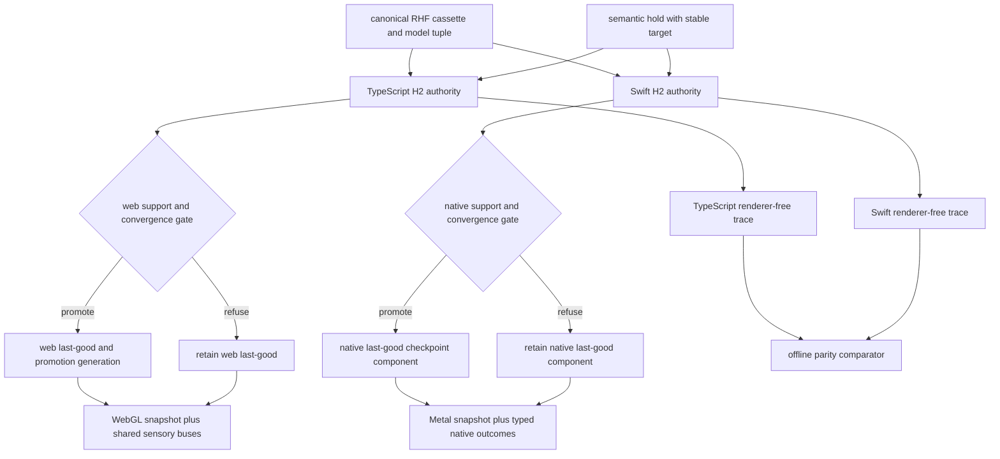
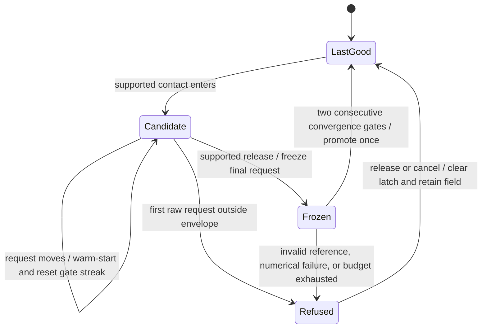

# H2 Self-Consistency Instrument - Plan

## Goal Capsule

- **Objective:** A visitor can perturb one H2 molecule on web or iOS, feel its electronic field correct toward a supported state, and distinguish convergence from refusal without mistaking the experience for electron motion or a general quantum solver.
- **Means:** Deepen the existing molecule scene with a separately versioned, offline RHF/STO-3G H2 subsystem and renderer-free cross-platform trace (KTD1-KTD5).
- **Authority:** Product behavior in R1-R20 overrides implementation units; the RHF cassette and model contract govern scientific values; `AGENTS.md`, `docs/gesture-grammar.md`, and `docs/native/simulation-contract.md` govern room and native behavior.
- **Execution profile:** Code implementation across TypeScript/WebGL, Swift/Metal, shared contracts, tests, guide data, and evidence artifacts.
- **Stop conditions:** Do not substitute an analytic animation if the RHF cassette cannot be reproduced, do not add a new route to avoid integration work, and do not ship a candidate state that can replace the last-good field after a failed support or convergence gate.
- **Tail ownership:** The implementing lane owns tests, guide screenshot, browser evidence, native simulator evidence, commit, push, PR, green CI, and merge.

---

## Product Contract

### Summary

Deepen `/molecules` and native `.molecules` with one canonical H2 electronic instrument.
The visitor changes H-H separation through the existing semantic gesture path, while a deterministic minimal-basis restricted Hartree-Fock loop updates a provisional density matrix.
Residual drives coupled visual, audio, and haptic tension until the candidate converges or ends in an explicit refusal state.
The current curated compound, vibration, and reaction instrument remains intact.

### Problem Frame

The current molecule experiences show formula, geometry, vibration, and curated reactions, but they jump from cause to finished appearance.
The supplied Kohn-Sham neural-operator research suggests a stronger artistic law: make self-consistent correction visible and revisable.
The manuscript does not provide deployable weights or evidence for browser or phone inference, so installing a learned runtime would create unsupported science and delivery risk.

### Key Decisions

- **The self-consistent molecule is the selected direction.** (session-settled: user-directed — chosen over continued ideation and the other ranked concepts because the user selected the top concept for development.) Governs R1-R20.
- **H2 deepens the existing molecule scene.** A focused electronic subsystem is contained at the molecule scale and does not justify another route, scale address, guide identity, or persistence authority. Governs R1, R8, R9, R12.
- **The first authority is RHF/STO-3G rather than the manuscript's neural operator.** The learned model and weights are unavailable, while a two-orbital RHF fixed-point map is reproducible and can be named honestly. Governs R2-R7, R13.

### Requirements

**Product boundary**

- R1. The feature must live inside the existing web `/molecules` room and native `.molecules` scene without adding `/h2`, a new native scene ID, or a new scale address.
- R2. The first proof must support only neutral singlet H2 with nuclei on one molecular axis and H-H separation from 0.60 through 1.20 Angstrom inclusive.
- R3. The current molecule population, balanced reaction rules, tap train, scale behavior, and non-H2 gesture meanings must remain behaviorally compatible.

**Scientific authority and trust**

- R4. A bundled, hashed cassette must contain 25 PySCF 2.6.2 RHF/STO-3G reference nodes at 0.025 Angstrom spacing with complete two-orbital integrals, converged references, nuclear repulsion, AO and tensor conventions, pinned Python/numeric/BLAS provenance, units, tolerances, model tuple, and source IDs.
- R5. TypeScript and Swift must implement the same 20 Hz logical-tick RHF map with 0.5 damping, a 64-iteration budget, no presentation-clock input, no runtime network, and no runtime learned model.
- R6. The authoritative residual must measure fixed-point density-matrix change; energy, reaction progress, electron time, and physical relaxation time must remain separate concepts.
- R7. Only a reference-verified in-envelope candidate that satisfies both cassette-declared convergence gates for two consecutive ticks may atomically replace the H2 last-good checkpoint; provisional state must never enter a durable checkpoint.
- R8. `max-iterations`, `outside-envelope`, `reference-unverified`, and `numerical-failure` must preserve the last-good field, emit a renderer-free disposition, and never silently clamp or substitute another model.

**Interaction and presentation**

- R9. A one-finger continuous hold on a focused H2 molecule with no reaction partner must perturb H-H separation as duration and intensity axes; the visitor must never paint or drag the density directly.
- R10. The authoritative residual and disposition must reach sight and sound in the same frame, with haptics where available, through the shared buses rather than renderer inference.
- R11. WebGL and Metal may render different expressions of the same field, but they must consume the same quantized intervention, iteration, residual milestone, disposition, and checkpoint values.
- R12. The feature must preserve keyboard and assistive semantic actions, reduced-motion state equivalence, hidden/background pause, governed frame cadence, bounded allocation, and a legible 390px web composition.

**State, evidence, and explanation**

- R13. The web persistence schema must migrate existing molecule populations through a self-contained v2 envelope, persist only H2 last-good state, preserve stable molecule identity, and distinguish missing, valid-empty, valid-populated, malformed, read-failed, and write-failed states without data loss.
- R14. The sought guide surfaces must explain the RHF/STO-3G envelope, residual, interpolation, and refusal boundary in plain and field-note voices; no explanatory copy or status HUD may appear inside the room.
- R15. A missing web record and the canonical native fixture must contain one stable-ID H2 body; a valid populated or explicitly empty room without H2 must stay unchanged until the existing open-field dwell, keyboard activation, or assistive equivalent creates H2 as the next deterministic molecule. Touch focuses the nearest stable body at contact entry, while keyboard and assistive paths use the same virtual-cursor hit-test and stable target resolver.
- R16. Accessibility-only state must announce each transition once, never each solver tick: correction active, settled, outside the supported range with last-good retained, and unable to settle with last-good retained. The channel must remain available when motion, audio, or haptics are unavailable, and it must add no visible room copy.
- R17. The first raw request outside the support envelope must latch `outside-envelope` for the rest of that continuous contact, discard the candidate, and retain last-good; re-entry during the same hold must not re-arm. Release or cancel clears the latch, and the next contact may retry; a discrete keyboard or assistive action may retry on its next action.
- R18. One continuous contact is one intervention epoch with a target body resolved at entry. In-envelope request changes warm-start from the current candidate, reset the consecutive-gate streak, and remain provisional; release freezes the final quantized request and permits the bounded solver to finish or promote. A request already passing both gates may promote on release, never while its target is still moving.
- R19. Web and native adapters must accumulate governed time into 50 ms authority ticks, schedule semantic commands on tick boundaries, and rebase after hidden/background suspension without catch-up. Presentation at 30, 60, or 120 Hz must not add, skip, or reorder authority ticks.
- R20. Shipping evidence must include independent PySCF oracle checks at all 25 nodes and all 24 deterministic midpoints, plus a versioned scientific-review record that names its reviewer, sources, reference cases, approximation and perceptual-mapping assessment, immutable evidence hash, and bounded-instrument decision. Reproducibility or cross-language agreement alone is not scientific approval.

### Key Flows

- F1. In-envelope correction
  - **Trigger:** The visitor holds a focused H2 molecule without a docking partner.
  - **Steps:** Raw separation passes the support boundary before quantization; the contact epoch warm-starts moving requests at 20 logical ticks per second; release freezes the final request; residual milestones reach sensory buses through typed outcomes; two consecutive passing gates atomically promote one H2 checkpoint after release.
  - **Outcome:** The new last-good field is authoritative and replayable.
  - **Covered by:** R2, R5-R7, R9-R12.
- F2. Unsupported or failed attempt
  - **Trigger:** Separation leaves the envelope, cassette verification fails, a numerical value becomes invalid, or the iteration budget ends.
  - **Steps:** The candidate receives a refusal disposition; an out-of-envelope contact latches until release; no checkpoint promotes; the prior last-good field remains visible; a distinct sensory release and one accessibility transition record the refusal. Release clears the contact latch so the next action may retry.
  - **Outcome:** Failure is legible without presenting an unsupported density as trusted.
  - **Covered by:** R7, R8, R10, R11.
- F3. Existing chemistry act
  - **Trigger:** The visitor acts on a non-H2 molecule or on an H2 molecule with a valid reaction partner.
  - **Steps:** Existing vibration, docking, reaction, tap-train, travel, and population laws run without entering the RHF subsystem.
  - **Outcome:** The room remains a curated chemistry instrument with one deeper H2 reading.
  - **Covered by:** R1, R3, R9.
- F4. Restore and migrate
  - **Trigger:** The web room loads a v1 record, a v2 record, an explicitly empty record, or malformed storage.
  - **Steps:** Only a missing record seeds starters; valid populations and stable IDs migrate; valid emptiness remains empty; malformed H2 data restores a canonical H2 state only when an H2 body exists; failed writes retain the readable v1 record and report migration as incomplete.
  - **Outcome:** Existing visitors keep their room and refusal cannot promote across reload.
  - **Covered by:** R7, R8, R13.
- F5. Reach and focus H2
  - **Trigger:** The visitor enters a fresh room, restores a population without H2, or returns to an explicitly empty room.
  - **Steps:** Fresh initialization includes one canonical H2. Existing populated or empty state is not mutated on load; its next open-field creation action deterministically makes H2, and all input modes resolve the same stable target body at contact entry.
  - **Outcome:** The instrument is reachable without volunteered instructions or a storage-state exception.
  - **Covered by:** R3, R9, R12, R15, R16.

### Acceptance Examples

- AE1. Given the canonical cassette and the same semantic action trace at 30, 60, and 120 presentation Hz, TypeScript and Swift produce identical action order, 20 Hz logical ticks, dispositions, milestone order, promotion generation, and quantized checkpoint digest; declared continuous fields remain within tolerance.
- AE2. Given a supported H-H separation change, residual rises from the prior fixed point and then passes both convergence gates for two consecutive ticks; exactly one new checkpoint promotes.
- AE3. Given a separation immediately below 0.60 or above 1.20 Angstrom, the attempt ends `outside-envelope`, does not clamp, does not promote, and leaves the prior last-good digest unchanged.
- AE4. Given a forced 64-iteration exhaustion or a numerical failure, the terminal disposition is recorded, the candidate is discarded, and the last-good field remains authoritative.
- AE5. Given a missing, corrupt, or model-mismatched cassette, the feature enters `reference-unverified` and performs no network request, runtime model load, or curated-chemistry fallback.
- AE6. Given a one-finger hold at 900 ms and another at 2400 ms on an isolated H2 molecule, the two traces request different supported separations or dispositions and produce different residual histories.
- AE7. Given the same H2 action through touch and keyboard or assistive activation, both paths emit the same semantic command and scientific outcome.
- AE8. Given reduced motion, hidden presentation, or unavailable audio/haptics, the logical trace and digest stay unchanged; presentation pauses without a catch-up loop and at least one accessible sensory path remains.
- AE9. Given a stored explicit empty molecule population, reload remains empty; given a legacy non-empty v1 population, migration preserves molecule IDs; given a quota failure or interrupted write, v1 remains readable and no provisional H2 state is reported as migrated.
- AE10. Given an existing reaction partner near H2, the current docking and balanced-reaction ceremony wins; the RHF hold path does not intercept or change stoichiometry.
- AE11. Given the guide or `?` mirror, both voices name the bounded RHF approximation and prohibited claims; given the room itself, no explanatory label, convergence badge, or tutorial copy appears.
- AE12. Given a representative 390px browser and the native simulator fixture, the field remains legible, uses one governed presentation loop, allocates no per-frame scientific arrays, and preserves existing molecule performance budgets.
- AE13. Given fresh, populated-without-H2, explicit-empty, restored-H2, and multiple-H2 states, fresh initialization contains one canonical H2; the other no-H2 states remain unchanged until the next open-field creation action makes H2; touch, keyboard, and assistive input resolve the same nearest stable body.
- AE14. Given correction, promotion, outside-envelope refusal, and other terminal refusal, each transition produces exactly one accessibility-only announcement with retry semantics; no solver tick repeats it, no visible room label appears, and disabling motion, audio, and haptics does not remove it.
- AE15. Given a hold that crosses outside support and then returns inside before release, the contact stays `outside-envelope`, last-good is unchanged, and no mixed success cue fires; after release, the next supported contact can converge. A discrete keyboard or assistive refusal can retry on the next action.
- AE16. Given every cassette node and all 24 adjacent-node midpoints, both runtime maps reproduce independent PySCF density, energy, and electron-count references within cassette-declared blocking thresholds before cross-language parity is accepted.
- AE17. Given release-candidate evidence, a versioned scientific review has an approved bounded-instrument decision and immutable evidence hash, and a blind 30-second browser and simulator play test identifies perturbation, settling, successful release, and refusal without guide narration.

### Success Criteria

- A recorded blind 30-second play test on web and simulator identifies perturbation, settling, successful release, and refusal from the material response alone; inability to distinguish any state fails the release gate.
- The committed fixture proves cross-platform scientific parity without requiring pixel parity or a production Python dependency.
- Existing molecule reaction, gesture-contract, guide, route, paint, and liveness tests remain green.

### Scope Boundaries

**Included**

- One H2 RHF/STO-3G field inside the existing molecule scene.
- Offline cassette generation and verification.
- TypeScript and Swift fixed-point authorities, renderer-free traces, local WebGL and Metal presentation, multisensory mapping, web persistence migration, guide updates, and test evidence.

**Deferred to follow-up work**

- Live native relaunch recovery through `UniverseProvider` and cross-device trace import/export; this slice proves native kernel and host checkpoint integrity without claiming relaunch persistence.
- Reciprocal-space, potential, model-migration, and reference-difference lenses.
- A generalized assessment type on every `KernelOutput`; the first proof keeps scientific disposition local to the H2 subsystem and maps non-promotable outputs to the existing host quarantine path.
- Manifest migration of the legacy web molecule room to `src/rooms/molecules/room.config.ts` unless a repository contract makes that migration necessary for this feature.
- Physical-device thermal and hardware-sensor evidence when compatible iPhone hardware is available.

**Outside this product's identity**

- KS-FNO inference, DFT or Kohn-Sham claims, learned runtime delivery, arbitrary molecules, geometry optimization, dissociation physics, reaction-coordinate authority, spectra, correlation beyond RHF, or a general quantum-chemistry solver.
- Density painting, in-room instructions, diagnostic dashboards, exact float equality, and cross-renderer pixel matching.

### Sources

- `docs/ideation/2026-08-25-kohn-sham-ios-web-ideation.html` — selected product direction, proof gates, and prohibited runtime assumptions.
- `docs/gesture-grammar.md` — global input meanings and duration/intensity laws.
- `docs/native/simulation-contract.md` — renderer-free authority, fixture, evidence, and promotion boundaries.
- `src/components/MoleculesField.tsx`, `src/lib/chemistry.ts`, and `src/lib/stoichiometry.ts` — current web molecule behavior and persistence.
- `packages/objet-universe-kit/Sources/ObjetUniverseCore/Molecules/MoleculeKernel.swift` and `packages/objet-universe-kit/Sources/ObjetUniverseRender/Molecules/` — current native molecule authority and renderer.
- [Khan et al., Learning the Kohn-Sham map with neural operators](https://tensorlab.cms.caltech.edu/users/anima/ks_fno/KS-FNO-manuscript.pdf) — self-consistent map inspiration and transfer boundary.
- [PySCF quickstart](https://pyscf.org/quickstart.html) — pinned offline RHF cassette generator API.

---

## Planning Contract

### Key Technical Decisions

- KTD1. **Use a molecule-local H2 subsystem identity.** Keep route, `SceneID`, manifest scene ID, renderer selection, and progression identity unchanged; nest `modelVersion`, `cassetteHash`, `quantizationVersion`, and `traceVersion` under `molecules`. This implements R1-R3 without conflating reaction and RHF state.
- KTD2. **Generate a canonical 25-node RHF/STO-3G cassette offline.** Pin PySCF 2.6.2 plus Python, NumPy, SciPy, and BLAS provenance; define decimal serialization and a payload hash that excludes its own digest field; store complete two-orbital integrals and converged references; generate byte-correlated TypeScript and Swift representations. Generate independent PySCF references at all 24 adjacent-node midpoints; block generation when maximum absolute density-matrix error exceeds `5e-4`, total-energy error exceeds `5e-5` Hartree, or `abs(Tr(P*S)-2)` exceeds `1e-8`. Record measured maxima beneath those fixed ceilings. No Python package ships in either client. Governs R2, R4, R5, R8, R20.
- KTD3. **Mirror one small RHF fixed-point map over evidence-tested interpolated integrals.** After raw geometry passes the inclusive support boundary, use the nearest three cassette nodes for quadratic interpolation of overlap, core, and every ERI tensor element in canonical AO ordering, and compute nuclear repulsion from the exact Coulomb expression at the requested separation; at each 20 Hz logical tick, solve the generalized eigenproblem, occupy the lowest canonicalized orbital twice, damp by 0.5, and quantize only at trace/checkpoint boundaries. This supersedes the plan's initial literal linear interpolation because the independent 24-midpoint PySCF oracle showed the linear energy seam exceeded the pre-registered `5e-5` Hartree ceiling, while the shipped method passes every unchanged blocking threshold. A cassette whose node replay or midpoint probe breaches KTD2 loads as `reference-unverified`, so an interior separation can never promote from parity alone. Governs R5-R8, R20.
- KTD4. **Separate contact epoch, candidate, last-good, and disposition.** The immutable subsystem state contains a stable target ID, contact epoch, candidate, last-good, disposition, model tuple, target geometry, gate streak, and promotion generation. A supported in-contact request change warm-starts from the candidate density and resets only the gate streak and per-request iteration count; release freezes the final request and allows its remaining 64-tick budget to finish. Persist and checkpoint only last-good after the gate in R7; all R8 terminals discard candidate state.
- KTD5. **Compare semantic traces, not frames.** Exact parity covers intervention order, 20 Hz logical ticks, milestone order, dispositions, promotion generation, and quantized digests; numeric matrices and energies use cassette-declared tolerances. Each platform owns its runtime gate, and an offline comparator proves equivalence. Governs R5, R7, R8, R11.
- KTD6. **Reuse the current gesture grammar conditionally.** The isolated-H2 hold branch receives the RHF intervention, while a nearby reaction partner and all non-H2 targets retain existing meanings. Governs R3, R9, R12.
- KTD7. **Add a shader projection without moving authority into rendering.** WebGL and Metal receive a compact immutable H2 snapshot and reconstruct presentation fields without mutating scientific state or allocating scientific arrays per frame. Governs R10-R12.
- KTD8. **Version web storage to v2 with an explicit initialization marker.** A missing record may seed starters; a valid empty record must not. The v1 key remains readable during migration and the v2 record owns H2 last-good state. Governs R13.
- KTD9. **Give every native molecule a deterministic authority identity.** Resolve the hold target once, carry `targetBodyID` through semantic contact payloads, and let an existing reaction partner take precedence over H2 perturbation. Governs R3, R9, R12.
- KTD10. **Make H2 access deterministic without changing restore semantics.** The missing-record starter set contains one H2. A valid no-H2 population stays byte-for-byte equivalent until the next existing open-field creation action, which selects H2 before resuming the seeded compound cycle. Stable hit testing chooses the nearest body at contact entry for every input mode. Governs R3, R9, R13, R15.
- KTD11. **Adapt presentation time into authority time at one seam per platform.** Each adapter accumulates governed elapsed time into 50 ms ticks, queues semantic changes for the next tick, and drops suspended backlog by rebasing on resume. Renderers may interpolate snapshots but cannot advance the authority. Governs R5, R12, R19.
- KTD12. **Publish scientific milestones once through typed sensory boundaries.** Web deduplicates on `modelVersion/bodyID/epoch/tick/kind`; native starts with a molecule-local H2 outcome adapter and the existing `SimulationOutcomeProducing` drain. A failing `MoleculeH2OutcomeIntegrationTests` may authorize only three generic outcome cases (`field-correcting`, `field-settled`, `field-refused`) and their exhaustive signature mapping; it does not authorize changes to `KernelOutput`, `UniverseHost` promotion, the clock, scene identity, or unrelated kernels. The generic gesture-release answer is suppressed when a scientific outcome owns that same release. Governs R10, R16.
- KTD13. **Compose the web field as one loop and two layers.** Keep the existing chemistry Canvas2D canvas as the lower layer and add one transparent, pointer-inert WebGL canvas above it. The room's existing governed RAF advances the fixed-tick adapter, draws chemistry, and draws the H2 projection from one immutable snapshot; context restoration rebuilds GL resources inside that loop and never creates a second scheduler. Governs R10-R12.
- KTD14. **Gate release on a versioned scientific review.** A committed review record hashes the cassette, oracle report, model tuple, projection mapping, sources, reviewer identity, decision, and limitations. The only approving decision is `approved-for-bounded-instrument`; it does not claim general physical validation or external peer review. Governs R4, R6, R14, R20.

### High-Level Technical Design

The cassette is common evidence, not a runtime service.
Each platform owns an independent implementation and gate for the same compact RHF law.
The offline comparator joins traces after execution; it is not a shared runtime authority.
The browser and native renderers receive immutable snapshots containing last-good field, candidate projection, residual, disposition, and promotion generation. The web and native promotion gates never consume each other's runtime trace; only the offline comparator joins their outputs.

### State and Promotion Sequence

### Assumptions

- The isolated build environment can run pinned PySCF to generate the committed cassette; if it cannot, implementation stops rather than replacing R4 with an unaudited analytic field.
- The current creation gesture remains the only way a valid no-H2 or explicitly empty room gains H2; loading such state never creates a body. R15 makes this a contract rather than an implementation assumption.
- Existing native scene persistence is not a launch claim for this slice; deterministic native state and traces are proven in the kernel and simulator, while live relaunch integration remains deferred.
- Existing molecule representations remain available; the first H2 field can appear as a local material response without adding a fifth global lens if implementation evidence shows that is clearer and smaller.
- One authority iteration is one 20 Hz logical tick on both clients; presentation may interpolate or pause but cannot add, skip, or reorder scientific iterations.
- Repository scientific review is an internal bounded-release gate. It must not be described as external peer review, hardware validation, or proof that RHF is accurate outside the declared envelope.

### System-Wide Impact

- Shared scientific data gains a generated cassette and versioned chemistry fixture, but Release 1 remains exactly wave, cell, and solar.
- Native molecules gain stable body IDs, optional immutable H2 snapshot data, and a typed outcome adapter; wave, cell, solar, and atom kernels retain their current output contracts.
- The native molecule checkpoint digest includes only promoted H2 last-good state, so generic host promotion can continue for chemistry without trusting provisional electronic state.
- Web molecule persistence migrates through a recoverable v2 envelope and fixes the existing explicit-empty reload defect without deleting a readable v1 record after a failed write.
- Guide data and evidence docs must distinguish the RHF model, interpolation, field presentation, and trust disposition from the room's balanced reaction system.

### Risks and Mitigations

- **Scientific overclaim:** Use RHF terminology in guide and source records; ban DFT, KS-FNO, electron-time, dissociation, and chemical-accuracy claims.
- **Interpolation drift:** Regenerate midpoint checks against PySCF and store measured maximum errors in cassette metadata; refuse extrapolation.
- **Cross-language eigenvector sign and ordering drift:** Canonicalize occupied-orbital sign and compare density matrices rather than raw eigenvectors.
- **Gesture collision with reaction ceremony:** Give an existing docking partner precedence and cover the branch with AE10.
- **Legacy canvas performance:** Keep scientific state compact and use the shared WebGL stage for the new field; do not add per-molecule 2D gradients or allocations.
- **Scope expansion through shared host changes:** Keep H2 disposition local unless a failing integration test proves a small generic host extension is required.
- **Migration interruption or quota failure:** Write and validate the complete v2 envelope before treating migration as successful; retain v1 as rollback input and persist no candidate state.
- **Target drift after restore:** Persist and honor stable molecule IDs; clear H2 association when its body retires; never attach last-good state to another equal-seed molecule.

### Sequencing

U1 establishes the subsystem schema, canonical cassette, model tuple, and generated platform representations.
U2 and U3 implement independent authorities against U1 and publish the immutable trace/snapshot seam.
U4 makes web migration safe before U8 connects live room state.
U5 adds web presentation after U8; U9 connects native target identity, checkpoints, typed outcomes, and Metal presentation after U3.
U6 joins guide and contract surfaces after both platform behaviors are stable.
U7 is the final integrated evidence gate.

---

## Implementation Units

### U1. Generate and verify the H2 RHF cassette

- **Goal:** Produce the subsystem schema, immutable scientific input, independent interpolation oracle, and generated platform representations required by R2, R4, R8, and R20.
- **Requirements:** R2, R4, R5, R8, R20; AE3, AE5, AE16.
- **Dependencies:** None.
- **Files:** `scripts/native/h2-rhf-requirements.txt`, `scripts/native/generate-h2-rhf-cassette.py`, `scripts/native/verify-h2-rhf-cassette.mjs`, `scripts/native/fixtures/h2-rhf-v1.json`, `packages/universe-contracts/src/h2-rhf.ts`, `packages/universe-contracts/src/index.ts`, `packages/universe-contracts/test/h2-rhf-cassette.test.ts`, `src/lib/h2-rhf-cassette.generated.ts`, `packages/objet-universe-kit/Sources/ObjetUniverseCore/Molecules/H2RHFCassette.generated.swift`, `packages/universe-contracts/package.json`, `package.json`.
- **Approach:**
  1. Define the model tuple and renderer-free trace/snapshot schema before either runtime authority.
  2. Generate the 25 reference nodes in an isolated pinned environment with declared AO/ERI ordering, orthogonalization, nuclear repulsion, canonical decimal serialization, and a payload hash that excludes its own digest field.
  3. Generate TypeScript and Swift constants from the same canonical bytes; record method, basis, envelope, spacing, solver tolerances, numeric-stack provenance, units, comparison policy, source IDs, midpoint errors, and model tuple.
  4. Replay every node through the exact runtime map within 64 iterations, then independently run PySCF at all 24 adjacent-node midpoints and enforce KTD2's density, total-energy, and electron-count ceilings before accepting the hash.
- **Execution note:** Establish a failing verifier test before accepting generated bytes; fixture regeneration must be an explicit model change.
- **Patterns to follow:** `scripts/native/generate-reference-fixtures.mjs`, `scripts/test-native-fixtures.mjs`, `docs/native/simulation-contract.md`.
- **Test scenarios:**
  - Covers AE5. Alter one cassette byte or model version and verify reference loading fails closed.
  - Covers AE3. Request geometry outside the inclusive envelope and verify the verifier exposes no extrapolated node.
  - Verify each node satisfies `Tr(P*S) = 2` within the declared tolerance.
  - Verify each node reconverges through the runtime map within 64 iterations and reproduces PySCF density and energy tolerances.
  - Covers AE16. Verify all 24 deterministic midpoints against independent PySCF runs and fail generation when any fixed ceiling is breached.
  - Verify regenerated canonical JSON, generated TypeScript, and generated Swift carry the same model tuple and payload SHA-256.
- **Verification:** A fresh isolated generator run reproduces the committed cassette, and the contract package rejects all malformed or unsupported variants.

### U2. Implement the TypeScript RHF authority and trace

- **Goal:** Provide a pure deterministic web/reference implementation of the R5-R8 state machine.
- **Requirements:** R5-R8, R11, R17-R19; AE1-AE6, AE15, AE16.
- **Dependencies:** U1.
- **Files:** `src/lib/h2-rhf.ts`, `src/lib/h2-rhf-cassette.generated.ts`, `scripts/test-h2-rhf.mjs`, `package.json`.
- **Approach:**
  1. Load and validate the cassette outside the frame loop.
  2. Implement two-orbital Fock construction, generalized eigen solve, canonical density construction, damping, residuals, energy checks, contact-epoch warm starts, release freeze, refusal latch, iteration budget, and promotion dispositions per KTD3-KTD5.
  3. Emit a bounded renderer-free trace with quantized intervention, 20 Hz logical ticks, iteration milestones, terminal disposition, last-good digest, and compact field snapshot; expose a pure elapsed-time-to-tick adapter with rebase and no-catch-up semantics.
- **Execution note:** Implement the pure law test-first; do not import DOM, WebGL, audio, haptics, or wall-clock APIs.
- **Patterns to follow:** `src/lib/chemistry.ts`, `src/lib/stoichiometry.ts`, `scripts/test-chemistry.mjs`, `scripts/test-stoichiometry.mjs`.
- **Test scenarios:**
  - Covers AE1. Replay one fixture at three presentation rates and compare the same logical trace and digest.
  - Covers AE2. Perturb within the envelope and verify one promotion after two passing gates.
  - Covers AE3. Test both immediate boundary neighbors without clamping.
  - Covers AE4. Force iteration exhaustion and a non-finite matrix, then verify last-good identity.
  - Covers AE5. Reject corrupt and mismatched cassette metadata without fallback.
  - Covers AE6. Compare 900 ms and 2400 ms semantic inputs and verify distinct trajectories.
  - Covers AE15. Cross support and re-enter during one contact, then verify the refusal latch and next-contact retry.
- **Verification:** The pure Node suite proves deterministic convergence, conservation, refusal, and replay independently of the room component.

### U3. Implement the Swift RHF authority and parity fixture

- **Goal:** Mirror the TypeScript law in native core and prove semantic parity without coupling renderers.
- **Requirements:** R5-R8, R11, R12, R17-R20; AE1-AE5, AE8, AE15, AE16.
- **Dependencies:** U1.
- **Files:** `packages/objet-universe-kit/Sources/ObjetUniverseCore/Molecules/H2RHFCassette.generated.swift`, `packages/objet-universe-kit/Sources/ObjetUniverseCore/Molecules/H2RHF.swift`, `packages/objet-universe-kit/Sources/ObjetUniverseCore/Molecules/H2RHFTrace.swift`, `packages/objet-universe-kit/Tests/ObjetUniverseCoreTests/H2RHFTests.swift`, `scripts/native/run-h2-rhf-fixtures.mjs`, `scripts/native/compare-h2-rhf-fixtures.mjs`, `scripts/test-h2-cross-language.mjs`, `package.json`.
- **Approach:**
  1. Decode the same cassette ordering and implement KTD3-KTD5 with platform-independent logical ticks.
  2. Canonicalize eigenvectors and checkpoint quantization exactly as the TypeScript authority does.
  3. Emit the same renderer-free fixture shape and compare exact semantic fields plus tolerance-governed numeric fields only after Swift independently matches every committed PySCF node and midpoint oracle.
- **Execution note:** Keep the new fixture lane separate from the fixed Release 1 three-scene fixture list.
- **Patterns to follow:** `packages/objet-universe-kit/Sources/ObjetUniverseCore/ScenarioTrace.swift`, `packages/objet-universe-kit/Tests/ObjetUniverseCoreTests/ScenarioTraceTests.swift`, `scripts/native/compare-cross-language-fixtures.mjs`.
- **Test scenarios:**
  - Covers AE1. Compare canonical, converged, refused, and exhausted traces across languages.
  - Covers AE2. Assert one checkpoint promotion and electron count after convergence.
  - Covers AE3-AE5. Match every terminal disposition and unchanged last-good digest.
  - Covers AE8. Change presentation cadence and reduced-motion presentation inputs without changing the authority trace.
  - Covers AE16. Compare Swift's converged density, total energy, and electron count at all 25 nodes and 24 midpoints directly with committed PySCF references before accepting language parity.
- **Verification:** Swift tests pass, the cross-language comparator passes, and fixture JSON contains no renderer, pixel, audio scheduler, or haptic engine keys.

### U4. Migrate web molecule persistence safely

- **Goal:** Preserve molecule identity, explicit emptiness, and H2 last-good state through a recoverable v2 migration.
- **Requirements:** R7, R8, R13; F4; AE4, AE5, AE9.
- **Dependencies:** U2.
- **Files:** `src/components/MoleculesField.tsx`, `src/lib/molecule-persistence.ts`, `src/lib/room-registry.ts`, `scripts/test-molecule-persistence.mjs`, `package.json`.
- **Approach:**
  1. Extract a pure parser/serializer for the missing, valid-empty, valid-populated, malformed, read-failed, and write-failed load matrix.
  2. Preserve persisted molecule IDs, cap populations deterministically, persist only H2 last-good plus its model tuple, and clear association when its body retires.
  3. Change the registry persistence key in this unit, then write and re-read the complete v2 envelope before reporting migration success; retain v1 as rollback input when a write or quota check fails.
- **Execution note:** Add characterization coverage for the current empty-record defect before changing initialization behavior.
- **Patterns to follow:** Existing `loadStored`, `save`, and `LetGo` paths in `src/components/MoleculesField.tsx`; deterministic parsers in `packages/universe-contracts/src/actions.ts`.
- **Test scenarios:**
  - Covers AE9. Test missing, v1 empty, v1 populated, v2 empty, v2 populated, malformed, read failure, quota failure, and interrupted-write states.
  - Clear the field during a provisional attempt, reload, and verify empty state with no candidate or last-good reassignment.
  - Restore duplicate-seed molecules and verify stable IDs keep H2 state attached to only its original body.
  - Retire the associated H2 body and verify its persisted subsystem state is removed rather than reassigned.
- **Verification:** The pure migration suite proves no valid population is discarded, valid empty stays empty, provisional state is never serialized, and failed migration retains a readable v1 rollback.

### U8. Integrate H2 authority and gestures into the web molecule room

- **Goal:** Make the isolated-H2 correction loop playable without changing existing chemistry acts.
- **Requirements:** R1-R3, R7-R12, R15-R19; F1-F3, F5; AE2-AE8, AE10, AE13-AE15.
- **Dependencies:** U2, U4.
- **Files:** `src/components/MoleculesField.tsx`, `src/lib/h2-rhf.ts`, `scripts/test-h2-rhf.mjs`, `scripts/test-room-contract.mjs`, `scripts/test-room-liveness.mjs`.
- **Approach:**
  1. Attach immutable candidate/last-good state to a deterministic H2 body, enforce KTD10's starter/no-H2 creation rule, and resolve the nearest stable target once per semantic contact for touch, keyboard, and assistive paths.
  2. Give an existing reaction partner precedence; otherwise map hold duration and intensity to raw separation, apply KTD4's warm-start/release-freeze state machine and R17's refusal latch, and advance only through the KTD11 20 Hz adapter.
  3. Publish a bounded snapshot, deduplicated scientific milestones, and one transition-only accessibility status while keeping shared gesture, governor, visibility, keyboard, audio, and haptic paths.
- **Patterns to follow:** Existing `attachGestures`, governor, visibility, keyboard, audio, and haptic paths in `src/components/MoleculesField.tsx`.
- **Test scenarios:**
  - Covers AE6. Exercise 900 ms and 2400 ms isolated-H2 holds and verify different requests and traces.
  - Covers AE7. Map keyboard and touch activation to the same authority command and target.
  - Covers AE8. Verify hidden pause and reduced motion do not add, skip, or reorder logical iterations.
  - Covers AE10. Put a supported reaction partner in range and verify existing stoichiometry wins.
  - Covers AE13. Exercise fresh, no-H2, empty, restored, and multiple-H2 targeting through every input path.
  - Covers AE14-AE15. Verify transition-only accessibility announcements, in-contact refusal latching, release clearing, and retry.
  - Verify every scientific milestone schedules each enabled sensory event exactly once.
- **Verification:** Room contract, liveness, chemistry, stoichiometry, keyboard, and reduced-motion checks pass with no new threshold, raw pointer path, or presentation-clock authority.

### U5. Render and sonify the H2 field on web

- **Goal:** Project the authoritative H2 snapshot through WebGL and shared web sensory buses.
- **Requirements:** R10-R12, R13, R16, R19; AE2-AE5, AE8, AE12, AE14.
- **Dependencies:** U8.
- **Files:** `src/components/MoleculesField.tsx`, `src/lib/webgl/stage.ts`, `scripts/test-h2-web-projection.mjs`, `scripts/test-room-paint.mjs`, `package.json`.
- **Approach:**
  1. Add one transparent, pointer-inert shared-stage canvas above the existing Canvas2D chemistry layer; both consume the same immutable last-good/candidate snapshot without exposing mutable authority buffers.
  2. Map residual to continuous interference and tension, and map terminal disposition to a deduplicated release or refusal cadence.
  3. Let the existing governed RAF drive Canvas2D, the fixed-tick adapter, and WebGL in order; rebuild programs after context restoration inside that loop, with no second RAF, interval, or timing source.
- **Execution note:** Treat the shader as a projection test target; it must not calculate convergence or support.
- **Patterns to follow:** `src/lib/webgl/stage.ts`, existing shared audio/haptic paths, and WebGL room consumers audited by `scripts/test-room-paint.mjs`.
- **Test scenarios:**
  - Covers AE2. Verify a converged snapshot produces the release sensory outcome once.
  - Covers AE3-AE5. Verify refusal snapshots keep last-good field coefficients and use distinct outcome kinds.
  - Covers AE8. Verify reduced motion freezes presentation oscillation without changing snapshot values.
  - Covers AE12. Verify bounded GPU records, no per-frame scientific allocations, context recovery, and existing body rendering.
- **Verification:** Web projection tests and visual inspection prove a readable local field without labels, a second RAF, or renderer-authored scientific state.

### U9. Integrate H2 authority, outcomes, and Metal presentation on native

- **Goal:** Give native molecules stable targeting, trustworthy H2 checkpoints, typed sensory outcomes, and a Metal projection of the same trace.
- **Requirements:** R1-R3, R5-R12, R15-R19; F1-F3, F5; AE1-AE8, AE10, AE12-AE15.
- **Dependencies:** U3.
- **Files:** `packages/objet-universe-kit/Sources/ObjetUniverseCore/Molecules/MoleculeKernel.swift`, `packages/objet-universe-kit/Sources/ObjetUniverseCore/Molecules/MoleculeRenderSnapshot.swift`, `packages/objet-universe-kit/Sources/ObjetUniverseCore/Molecules/MoleculeH2Outcome.swift`, `packages/objet-universe-kit/Sources/ObjetUniverseRender/Molecules/MoleculeRenderer.swift`, `packages/objet-universe-kit/Sources/ObjetUniverseRender/Molecules/MoleculeShaders.swift`, `packages/objet-universe-kit/Sources/ObjetUniverseSensory/MoleculeH2SensoryAdapter.swift`, `packages/objet-universe-kit/Tests/ObjetUniverseCoreTests/ProofKernelTests.swift`, `packages/objet-universe-kit/Tests/ObjetUniverseCoreTests/MoleculeH2OutcomeIntegrationTests.swift`, `packages/objet-universe-kit/Tests/ObjetUniverseCoreTests/MoleculeTargetingIntegrationTests.swift`, `packages/objet-universe-kit/Tests/ObjetUniverseCoreTests/RendererLifecycleTests.swift`, `packages/objet-universe-kit/Tests/ObjetUniverseCoreTests/MoleculeMetalRenderTests.swift`, `packages/objet-universe-kit/Tests/ObjetUniverseSensoryTests/SensoryPresentationTests.swift`. Conditional KTD12 extension only: `packages/objet-universe-kit/Sources/ObjetUniverseCore/SimulationProtocol.swift`, `apps/native/modules/objet-universe/ios/UniverseRuntime.swift`, and `apps/native/modules/objet-universe/ios/ObjetUniverseSurfaceView.swift`; do not edit `UniverseHost.swift`, and edit the generic runtime/surface only after the named outcome or targeting integration test proves its precise missing seam.
- **Approach:**
  1. Add deterministic molecule IDs, expose a molecule-kernel target query for the existing stable `targetBodyID` payload, initialize one canonical isolated-H2 test fixture, and apply KTD10 focus/creation behavior without changing scene identity.
  2. Keep candidate/disposition molecule-local; include only promoted H2 last-good state in the molecule checkpoint digest; emit idempotent typed H2 milestones through the existing outcome drain and suppress duplicate generic release feedback. First write the failing typed-outcome and target-query integration tests; only their precise missing seams authorize KTD12's two-file generic extension.
  3. Extend the immutable molecule snapshot and Metal uniforms with H2 field data, promotion generation, residual, and disposition while preserving bounded GPU records and reduced motion.
- **Execution note:** Test the real `UniverseHost` promotion boundary before connecting Metal presentation.
- **Patterns to follow:** `SolarKernel` stable body targeting and outcomes, current molecule snapshot/renderer, `UniverseHost` quarantine tests, and `SensoryEvent` mappings.
- **Test scenarios:**
  - Covers AE1-AE5. Verify provisional ticks leave the H2 checkpoint component unchanged, the second passing gate changes it once, and every refusal preserves it.
  - Covers AE7. Verify touch and assistive actions carry the same native molecule target ID and command.
  - Covers AE8. Verify presentation cadence, background pause, reduced motion, and unavailable sensory buses do not change the authority trace.
  - Covers AE10. Verify a reaction partner takes precedence over H2 perturbation.
  - Covers AE12. Verify Metal pack bounds, shader fixture output, surface recovery, and no scientific allocation per frame.
  - Covers AE13-AE15. Verify deterministic H2 creation/focus, transition-only accessibility semantics, refusal latch/retry, and one sensory event ID per milestone.
- **Verification:** Swift core, host, renderer, and sensory tests pass; the native checkpoint never incorporates a provisional H2 candidate; simulator evidence shows the Metal field and accessibility path.

### U6. Update contracts, guide, and scientific evidence

- **Goal:** Make every public and release-facing description truthful after the behavior changes.
- **Requirements:** R1-R4, R6, R8, R14-R16, R20; AE5, AE11, AE14, AE16, AE17.
- **Dependencies:** U1-U5, U8, U9.
- **Files:** `packages/universe-contracts/src/manifest.ts`, `packages/universe-contracts/test/contracts.test.ts`, `docs/native/scientific-references.md`, `docs/native/simulation-contract.md`, `docs/native/evidence-schema.md`, `docs/native/reviews/h2-rhf-v1.json`, `src/data/guide.ts`, `apps/native/src/guide/guideData.ts`, `apps/native/src/guide/GuideSheet.tsx`, `DESIGN.md`.
- **Approach:**
  1. Version the chemistry manifest and name the H2 model, envelope, invariants, approximations, reference cases, and internal-review boundary without changing Release 1.
  2. Extend the renderer-free evidence schema for H2 milestones and dispositions while keeping presentation keys prohibited.
  3. Update both guide voices, native reading surfaces, and transition-only accessibility strings; leave the already-owned registry key to U4 and screenshot capture to U7 after final rendering.
  4. Commit KTD14's hashed scientific-review record after an independent review lane checks the PySCF oracle, approximation language, and visual/audio mapping; fail release unless its decision is `approved-for-bounded-instrument`.
- **Patterns to follow:** Existing chemistry entries in `packages/universe-contracts/src/manifest.ts` and the molecule entry in `src/data/guide.ts`.
- **Test scenarios:**
  - Covers AE5. Contract validation rejects a missing model version, envelope, comparison policy, source ID, or approximation disclosure.
  - Covers AE11. Guide tests prove both voices exist and the component contains no copied room prose.
  - Verify Release 1 remains exactly wave, cell, and solar.
- **Verification:** Contract, native scope, guide, room-help, routes, and screenshot-presence checks pass; documentation contains no prohibited scientific claim.

### U7. Run integrated browser, native, and regression evidence

- **Goal:** Demonstrate that the complete feature satisfies R1-R20 without regressing the album or native shell.
- **Requirements:** R1-R20; AE1-AE17.
- **Dependencies:** U1-U6, U8, U9.
- **Files:** `iterations/`, `public/guide/molecules.jpg`, and only targeted regression tests required by failures discovered during verification.
- **Approach:**
  1. Run focused scientific, cross-language, molecule, contract, and rendering tests before the complete repository gates.
  2. Exercise canonical convergence, outside-envelope refusal, iteration exhaustion, explicit-empty reload, keyboard parity, reduced motion, hidden pause, and reaction precedence in a real 390px browser.
  3. Exercise the molecule scene in the iOS simulator, capture native evidence, inspect Metal fallback, accessibility actions, and sensory event order, then re-shoot the molecule guide image.
  4. Run a blind 30-second browser and simulator play test from normal entry with reviewers who have not read guide narration; record whether all four material states are identified, and fail the release gate when any state is not distinguishable.
- **Execution note:** Fix feature-caused failures in their owning unit; report unrelated baseline failures without weakening a contract.
- **Patterns to follow:** `scripts/smoke-*.mjs`, `scripts/shoot-guide.mjs`, `docs/native/evidence-schema.md`.
- **Test scenarios:**
  - Covers AE1-AE17 through the integrated browser, native, oracle, internal scientific-review, accessibility, and blind-play evidence matrix.
  - Verify no runtime request can leave the app for H2 data or inference.
  - Verify the final diff contains no experimental fallback, abandoned shader, dead fixture, or unused resolver.
- **Verification:** All commands in the Verification Contract pass, final artifacts show 390px and native behavior, and the PR contains the resulting guide screenshot and evidence notes.

---

## Verification Contract

| Gate | Command or evidence | Proves |
|---|---|---|
| Cassette and oracle | `npm run test:h2-rhf-cassette`; regeneration in the pinned disposable PySCF environment uses `python3 scripts/native/generate-h2-rhf-cassette.py` and must reproduce the committed SHA/oracle report | R4 and R20 reproducibility, all-node replay, and 24-midpoint PySCF validation |
| TypeScript authority | `npm run test:h2-rhf` | R5-R9 and R17-R19 deterministic law, clock, and failure behavior |
| Cross-language parity | `npm run test:h2-cross-language` and `cd packages/objet-universe-kit && swift test` | R5, R7, R8, R11, R17-R20 and AE1-AE5, AE15-AE16 |
| Web molecule regressions | `npm run test:molecule-persistence`, `npm run test:h2-web-projection`, `npm run test:chemistry`, `npm run test:stoichiometry`, `npm run test:room-contract`, `npm run test:room-liveness`, `npm run test:paint` | R1, R3, R9-R19 |
| Shared/native contracts | `npm run test:universe-contracts`, `npm run test:native-scope`, `npm run native:check` | R4-R8, R11, R12, R14 |
| Static quality | `npm run lint` and `npx tsc --noEmit` | Type and lint correctness |
| Full regression | `npm test` and `npm run build` | Repository-wide compatibility |
| Browser behavior | Real browser at 390px plus reduced-motion, keyboard, accessibility status, hidden-tab, context-loss, clear/reload, focus, convergence, refusal-latch, and retry scenarios | AE2-AE15 web evidence |
| Native behavior | iOS simulator molecule flow, stable targeting, accessibility action parity, reduced motion, Metal presentation, refusal retry, and sensory signpost inspection | AE1-AE15 native evidence |
| Scientific review | Hash and validate `docs/native/reviews/h2-rhf-v1.json` against the cassette, oracle report, projection mapping, named reviewer, and `approved-for-bounded-instrument` decision | R20, AE16, and the internal review boundary |
| Blind material read | Recorded 30-second browser and simulator play tests from normal entry, without guide narration | AE17 and the user-facing success criterion |
| Documentation | `npm run shoot:guide -- --only=molecules`, `npm run test:guide`, and `npm run test:room-help` | R14 and AE11 |

Physical-device thermal, hardware motion, and Taptic evidence is required before claiming hardware validation, but unavailable hardware does not authorize a simulator result to be relabeled as device evidence.

---

## Definition of Done

- U1-U9 satisfy their listed verification outcomes and acceptance examples.
- One semantic trace proves the same canonical, converged, refused, and exhausted cases in TypeScript and Swift.
- Every TypeScript and Swift node result and every deterministic midpoint passes the independent PySCF oracle before parity is considered meaningful.
- The room preserves every current chemistry behavior outside the isolated-H2 branch.
- No candidate from an unsupported, unverified, exhausted, or numerical-failure attempt can replace last-good state.
- The web explicit-empty persistence defect is fixed, failed migration retains readable v1 state, and neither candidate nor reassigned H2 state can enter v2 storage.
- WebGL and Metal render from immutable authority snapshots; no renderer calculates scientific state or allocates scientific arrays per frame.
- Sight and sound respond to every meaningful H2 act in the same frame; native or browser haptics join where available.
- Fresh, valid-no-H2, explicit-empty, restored, and multiple-H2 states all preserve the deterministic access and stable-focus contract across touch, keyboard, and assistive paths.
- Every scientific accessibility transition announces once without visible room copy; refusal stays latched through in-contact re-entry and clears only for the next retry.
- The feature adds no raw pointer handling, private gesture threshold, in-room explanation, runtime network dependency, runtime ML dependency, or new route.
- Guide data, native reading surfaces, scientific references, contracts, and the molecule screenshot match shipped behavior.
- The versioned scientific-review record approves only the bounded instrument, hashes immutable evidence, and is never described as external peer review or general physical validation.
- Blind 30-second web and simulator reviewers distinguish perturbation, settling, successful release, and refusal without guide narration.
- Lint, typecheck, focused tests, Swift tests, native checks, full `npm test`, build, browser evidence, and simulator evidence pass or contain a clearly isolated pre-existing failure that does not weaken acceptance.
- Abandoned experiments, unused files, dead fixtures, unconsumed helpers, generated temporary environments, and fallback implementations are absent from the final diff.
- The branch is committed, pushed, reviewed, green in CI, merged, and the post-merge main state is verified.

### Bro

Build one honest H2 instrument inside the molecule room, make both apps follow the same small scientific law, and refuse any state the evidence cannot support. Keep the existing chemistry alive around it, prove every boundary, and ship only after the room reads clearly without instructions.
